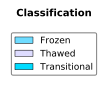

# Access Advanced Topics

   * [Layer Naming Convention](#layer-naming-convention)
   * ["Best Available" Layers](#best-available-layers)
   * [Domain Sharding](#domain-sharding)
   * [Tiled Access Resolutions](#tiled-access-resolutions)
   * [Mapping RGB to Data Values](#mapping-rgb-to-data-values)
   * [Vector Visualizations](#vector-visualizations)

<hr style="border:2px solid gray"> </hr>

## Layer Naming Convention
GIBS visualization layer identifiers follow a human-readable convention (e.g. *MODIS_Terra_Aerosol_Optical_Depth_v6_STD*) to simplify situations where manual parsing of service documentation (e.g. WMTS GetCapabilities) is performed. Identifiers include uniquely identifying information like the following items:

* **Instrument/Platform** - The Instrument and Platform responsible for collecting the visualized data (e.g. "MODIS / Terra")
* **Science Parameter** - The science parameter that is being visualized (e.g. "Aerosol Optical Depth")
* **Processing Level** - The processing level of the associated data (e.g. "L3" or "L2")
* **Data Period** - The period of the available visualization products (e.g. "Monthly")
    * If not included, it is implied that the visualization has a "Daily" period 
* **Data Version** - The version of the associated data product (e.g. "v6")
* **Data Latency** - The latency of the associated data product (e.g. "STD" or "NRT")

The following are examples of visualization identifiers for the "Aerosol Optical Depth" science parameter collected by the MODIS instrument on the Terra platform. In this example, visualization layers exist for a combination of data versions and latencies. The first item is considered the "Best Available" layer, which is described further in the following section.

* MODIS_Terra_Aerosol_Optical_Depth
* MODIS_Terra_Aerosol_Optical_Depth_v6_NRT
* MODIS_Terra_Aerosol_Optical_Depth_v6_STD
* MODIS_Terra_Aerosol_Optical_Depth_v5_NRT

<hr style="border:2px solid gray"> </hr>

## "Best Available" Layers

Visualizations representing the same science parameter from a specific instrument and platform may be available for multiple data versions and/or latencies. Direct access to those various flavors of the same visualization are available. However, many users may simply want to interact with a single, combined, visualization.  Therefore, GIBS provides a set of "Best Available" visualization layers that abstract away the individual versions and latencies.  The determination of what is considered "best" is coordinated with each visualization's provider. In most cases, the following priority is used:

1. Latest Version Standard Product
2. Latest Version NRT
3. Previous Version Standard Product
4. Previous Version NRT


See the image above for a visual example. The top four bars show the temporal coverage of related visualizations. The bottom bar shows the visualization that will be returned based on the "best available" determination.

<hr style="border:2px solid gray"> </hr>

## Domain Sharding
The HTTP/1.1 specification limits the number of concurrent requests from a browser to the same server based on domain. When loading multiple map tiles in a user interface, this limitation results in a sub-optimal interaction.  The common workaround is to employ "domain sharding", which splits content across multiple subdomains. By doing so, browsers can download resources simultaneously, thus increasing the number of tiles loaded and improving the user experience. The HTTP/2 specification removed the limitation by allowing a browser to issue multiple simultaneous requests across a single connection.  Thus eliminating the need for domain sharding.

At present, GIBS infrastruction _does not_ support HTTP/2 connections.  Instead, clients must still utilize the HTTP/1.1 domain sharding approach to simultaneously download multiple tiles.  The available subdomains for the GIBS system are listed below:

   * [https://gibs-a.earthdata.nasa.gov](https://gibs-a.earthdata.nasa.gov)
   * [https://gibs-b.earthdata.nasa.gov](https://gibs-b.earthdata.nasa.gov)
   * [https://gibs-c.earthdata.nasa.gov](https://gibs-c.earthdata.nasa.gov)
     
Note that these are simply aliases for the [https://gibs.earthdata.nasa.gov](https://gibs.earthdata.nasa.gov) domain.

<hr style="border:2px solid gray"> </hr>

## Tiled Access Resolutions
GIBS visualizations are fundamentally a set of pre-generated raster or vector tiles that comply with a known gridding structure and resolution (a.k.a. "TileMatrixSet"). These tiles are made available through tiled services (e.g. WMTS and TWMS) or non-tiled services (e.g. WMS).  The latter reads the native tiles and then slices and stitches as needed to create the requested output.  When developing visualizations, GIBS coordinates with the data owners to determine the "appropriate" resolution.

The following subsections provide details regarding each projection's supported resolutions:

### WGS 84 / Lat-lon / Geographic (EPSG:4326)
| Resolution (per pixel) | Tile Matrix Set (WMTS) | # Zoom Levels | Max Resolution (deg/pixel) | Min Resolution (deg/pixel) |
| ---------------------- | ---------------------- | ------------- | -------------------------- | -------------------------- |
| 15.125m | 15.125m | 13 | 0.5625 | 0.0001373291015625 |
| 31.25m | 31.25m | 12 | 0.5625 | 0.000274658203125 |
| 250m | 250m | 9 | 0.5625 | 0.002197265625 |
| 500m | 500m | 8 | 0.5625 | 0.00439453125 |
| 1km | 1km | 7 | 0.5625 | 0.0087890625 |
| 2km | 2km | 6 | 0.5625 | 0.017578125 |


### NSIDC Sea Ice Polar Stereographic North (EPSG:3413)
| Resolution (per pixel) | Tile Matrix Set (WMTS) | # Zoom Levels | Max Resolution (deg/pixel) | Min Resolution (deg/pixel) |
| ---------------------- | ---------------------- | ------------- | -------------------------- | -------------------------- |
| 250m | 250m | 6 | 8192.0 | 256.0 |
| 500m | 500m | 5 | 8192.0 | 512.0 |
| 1km | 1km | 4 | 8192.0 | 1024.0 |
| 2km | 2km | 3 | 8192.0 | 2048.0 |

### Antarctic Polar Stereographic (EPSG:3031)
| Resolution (per pixel) | Tile Matrix Set (WMTS) | # Zoom Levels | Max Resolution (deg/pixel) | Min Resolution (deg/pixel) |
| ---------------------- | ---------------------- | ------------- | -------------------------- | -------------------------- |
| 250m | 250m | 6 | 8192.0 | 256.0 |
| 500m | 500m | 5 | 8192.0 | 512.0 |
| 1km | 1km | 4 | 8192.0 | 1024.0 |
| 2km | 2km | 3 | 8192.0 | 2048.0 |

### Web Mercator (EPSG:3857)
!!! Note
    GIBS does not store visualizations in this projection. Instead, tiles are reprojected on-the-fly from Geographic (EPSG:4326) sources.


| Resolution (per pixel) | Tile Matrix Set (WMTS) | # Zoom Levels | Max Resolution (deg/pixel) | Min Resolution (deg/pixel) |
| ---------------------- | ---------------------- | ------------- | -------------------------- | -------------------------- |
| 19.10925707129405m | GoogleMapsCompatible_Level13 | 13 | 156543.03390625 | 19.10925707129405 |
| 38.21851414258810m | GoogleMapsCompatible_Level12 | 12 | 156543.03390625 | 38.21851414258810 |
| 305.7481131407048m | GoogleMapsCompatible_Level9 | 9 | 156543.03390625 | 305.7481131407048 |
| 611.4962262814100m | GoogleMapsCompatible_Level8 | 8 | 156543.03390625 | 611.4962262814100 |
| 1222.992452562820m | GoogleMapsCompatible_Level7 | 7 | 156543.03390625 | 1222.992452562820 |
| 2445.984905125640m | GoogleMapsCompatible_Level6 | 6 | 156543.03390625 | 2445.984905125640 |

<hr style="border:2px solid gray"> </hr>

## Mapping RGB to Data Values
Visualizations of scientific parameters (See [Visualization Categories](../available-visualizations/#categories)) are generated by mapping data values, or value ranges, to specific RGB values.  These scientific parameters represent data from one of the following categories:

* **Continuous** - Data values are captured as continuous values between an implicit or explicit minimum and maximum. The capturing instrument or processing system may impose a consistent precision. For example, aerosol optical depth where any value between -0.70 and 5.00 are possible. The data-to-image mapping process will associate a range of values with a specific color.
* **Discrete** - Data values are captured as discrete values between an implicit or explicit minimum and maximum, though typically the latter. For example, percent cloud cover where only whole numbers between 0 and 100 are possible. The data-to-image mapping process will typically associate each discrete value with a specific color.
* **Classification** - Data values are captured and mapped to non-measured (i.e. unitless) values. For example, land cover type with values of "Forest", "Sand", etc... The data-to-image mapping process will associate each classification value with a specific color.

Clearly documenting the data value(s) and an RGB value is essential to correctly generate and interpret these visualizations.  To accomplish this, the "GIBS Colormap" specification was developed and is utilized to guide the creation and use of "GIBS Colormaps".  The following sections provide information regarding the specification, how the GIBS Colormaps are accessed, and various examples.

### GIBS Colormap Specification
The GIBS Colormap specification guides the creation of GIBS Colormap XML documents that comply with an ([XML Schema](https://gibs.earthdata.nasa.gov/schemas/ColorMap_v1.3.xsd){:target="_blank"}).  Each XML document contains the information required to map data values and RGB colors in a raster visualization.  The necessary information required to generate a legend graphic representation of the mapping is also provided.  See below for the fields included in each of these content area's entries.

!!! Note
    The terms "Colormap entry" and "Legend entry" are used to identify individual entries within the data-to-rgb value mapping and legend XML elements, respectively.

**Data To RGB Value Mapping**

* **Ref** - The unique reference id used when associating Colormap entries to Legend entries.
* **RGB** - The visual color associated with the data value(s).
* **Transparent** - A boolean value designating whether the Colormap entry will be opaque or transparent
* **Raw Value(s)** - The associated data values contained within the source data file(s).
* **Scaled Value(s)** - The scaled data values to which units will be applied, if appropriate, for display to end users. If this is a classification, then the appropriate label is provided for reference.
* **No Data** - A boolean value designating whether the Colormap entry is the "no data" value or not.

**Legend Representation**

* **ID(s)** - The `ref` values (see above) to which the Legend entry is associated.
* **RGB** - The visual color associated with the Legend entry.
* **Tooltip** - A unit-agnostic human-readable label for the Legend entry.
* **Show Tick** - A boolean designating whether a tick mark should be used for this Legend entry in a generated legend graphic.
* **Show Label** - A boolean designating whether a text label should be used for this Legend entry in a generated legend graphic.

### Metadata Association
A raster visualization's GIBS Colormap XML document is associated to a GIBS visualiation as `Layer/ows:Metadata` elements within the WMTS Capabilities document. The following snippet shows an example of how these elements will appear. Note that there are three entries listed. One is for the "default" file and the other two are for versioned (e.g. `1.3`) files. This allows for the addition of future versions while retaining support for previous versions.  Case in point, the `v1.0` version is referenced to support legacy functionality.  Whereas `1.3` is the most recent, and default, version to be used.

``` xml
<ows:Metadata xlink:type="simple" 
              xlink:role="http://earthdata.nasa.gov/gibs/metadata-type/colormap" 
              xlink:href="https://gibs.earthdata.nasa.gov/colormaps/v1.3/AMSR_Surface_Precipitation.xml" 
              xlink:title="GIBS Color Map: Data - RGB Mapping"/>
              
<ows:Metadata xlink:type="simple" 
              xlink:role="http://earthdata.nasa.gov/gibs/metadata-type/colormap/1.0" 
              xlink:href="https://gibs.earthdata.nasa.gov/colormaps/v1.0/AMSR_Surface_Precipitation.xml" 
              xlink:title="GIBS Color Map: Data - RGB Mapping"/>

<ows:Metadata xlink:type="simple" 
              xlink:role="http://earthdata.nasa.gov/gibs/metadata-type/colormap/1.3" 
              xlink:href="https://gibs.earthdata.nasa.gov/colormaps/v1.3/AMSR_Surface_Precipitation.xml" 
              xlink:title="GIBS Color Map: Data - RGB Mapping"/>
```

### Pre-Generated Legends
As described previously, each GIBS Colormap XML document contains the information required (e.g. labels and tick marks) to generate a legend graphic image.  Visualization clients may utilize this information to generate their own legend images, if desired.  However, for ease of access, the GIBS system provides the following pre-generated legend images for each GIBS Colormap XML document.

|  Format |  Orientation  | Sample URL |   Sample Image  |
| ------- | ------------- | ----------- | --------------- |
|   PNG   |   Horizontal  | [link](https://gibs.earthdata.nasa.gov/legends/AMSR_Wind_Speed_H.png){:target="_blank"} |  |
|   SVG   |   Horizontal  | [link](https://gibs.earthdata.nasa.gov/legends/AMSR_Wind_Speed_H.svg){:target="_blank"} |  |
|   SVG   |   Vertical    | [link](https://gibs.earthdata.nasa.gov/legends/AMSR_Wind_Speed_V.svg){:target="_blank"} |  |

These pre-generated legends are referenced in the WMTS and WMS Capabilities documents as is described below.

**WMTS Capabilities**

Pre-generated legends are referenced in the WMTS Capabilities document within the `Style/LegendURL` elements. The following snippet shows an example of how these elements will appear. Note that only the SVG-formatted legends are referenced. 

``` xml
<Style isDefault="true">
    <ows:Title xml:lang="en">default</ows:Title>
    <ows:Identifier>default</ows:Identifier>
    <LegendURL format="image/svg+xml" xlink:type="simple" 
        xlink:role="http://earthdata.nasa.gov/gibs/legend-type/vertical" 
        xlink:href="https://gibs.earthdata.nasa.gov/legends/AMSR_Wind_Speed_V.svg" 
        xlink:title="GIBS Color Map Legend: Vertical" width="135" height="287"/>
    <LegendURL format="image/svg+xml" xlink:type="simple" 
        xlink:role="http://earthdata.nasa.gov/gibs/legend-type/horizontal" 
        xlink:href="https://gibs.earthdata.nasa.gov/legends/AMSR_Wind_Speed_H.svg" 
        xlink:title="GIBS Color Map Legend: Horizontal" width="377" height="85"/>
</Style>
```

**WMS Capabilities**

Pre-generated legends are referenced in the WMS Capabilities document within the `Style/LegendURL` element. The following snippet shows an example of how this element will appear. Note that only the PNG-formatted legend is referenced.

``` xml
<Style>
    <Name>default</Name>
    <Title>default</Title>
    <LegendURL width="420" height="95">
        <Format>image/png</Format>
        <OnlineResource xmlns:xlink="http://www.w3.org/1999/xlink" xlink:type="simple" 
            xlink:href="https://gibs.earthdata.nasa.gov/legends/AMSR_Wind_Speed_H.png"/>
    </LegendURL>
</Style>
```


### Examples

The following sections provide examples of Colormaps for each data category. Each example provides a table containing the values that define the data-to-rgb mapping process, the sample XML document, and a pre-generated legend image.  As you review each example, you will see that they each contain a no-data Colormap entry, as is required by the specification. This entry is always considered to be a "Classification" mapping type. As such, it will be contained within its own Colormap element for necessity in the Discrete and Continuous mapping types.

<hr style="border:1px solid gray"> </hr>

#### Discrete Data
In this example, the following Colormap and Legend entries define a mapping for single, discrete, values from 70 to 110. The units for the measured parameter are meters or "m".

**Colormap Entries**

|  Ref |     RGB     | Transparent |   Raw Value(s)  | Scaled Value(s) | No Data |
| ---- | ----------- | ----------- | --------------- | --------------- | --------|
|   1  | 220,220,255 | True        | [-9999]         | N/A             | True   |
|   2  | 100,000,119 | False       | [7000]          | [70]            | False   |
|   3  | 100,100,119 | False       | [8000]          | [80]            | False   |
|   4  | 200,000,119 | False       | [9000]          | [90]            | False   |
|   5  | 200,100,119 | False       | [10000]         | [100]           | False   |
|   6  | 200,200,119 | False       | [11000]         | [110]           | False   |

**Legend Entries**

| ID(s) |     RGB     |    Tooltip    | Show Tick  | Show Label |
| ----- | ----------- | ------------- | ---------- | ---------- |
|   1   | 220,220,255 | "Fill"        | False      | False      |
|   2   | 100,000,119 | 70            | False      | False      |
|   3   | 100,100,119 | 80            | False      | False      |
|   4   | 200,000,119 | 90            | False      | True       |
|   5   | 200,100,119 | 100           | False      | False      |
|   6   | 200,200,119 | 110           | False      | False      |

Using the information provided above, the following XML Colormap and legend are generated:

```xml
<ColorMaps>
    <ColorMap title="Fill">
        <Entries>
            <ColorMapEntry rgb="220,220,255" transparent="true" sourceValue="[-9999]" nodata="true" ref="1"/>
        </Entries>
        <Legend type="classification">
            <LegendEntry rgb="220,220,255" tooltip="Fill" id="1"/>
        </Legend>
    </ColorMap>

    <ColorMap title="Discrete Example" units="m">
        <Entries>
            <ColorMapEntry rgb="100,000,119" transparent="false" sourceValue="[7000]" value="[70]" ref="2"/>
            <ColorMapEntry rgb="100,100,119" transparent="false" sourceValue="[8000]" value="[80]" ref="3"/>
            <ColorMapEntry rgb="200,000,119" transparent="false" sourceValue="[9000]" value="[90]" ref="4"/>
            <ColorMapEntry rgb="200,100,119" transparent="false" sourceValue="[10000]" value="[100]" ref="5"/>
            <ColorMapEntry rgb="200,200,119" transparent="false" sourceValue="[11000]" value="[110]" ref="6"/>
        </Entries>
        <Legend type="discrete" minLabel="70" maxLabel="110">
            <LegendEntry rgb="100,000,119" tooltip="70" id="2"/>
            <LegendEntry rgb="100,100,119" tooltip="80" id="3"/>
            <LegendEntry rgb="200,000,119" tooltip="90" label="90" id="4" showLabel="true"/>
            <LegendEntry rgb="200,100,119" tooltip="100" id="5"/>
            <LegendEntry rgb="200,200,119" tooltip="110" id="6"/>
        </Legend>
    </ColorMap>
</ColorMaps>
```


<hr style="border:1px solid gray"> </hr>

#### Continuous Data
In this example, the following Colormap and Legend entries define a mapping for value ranges from < 10 to 50 (exclusive). The units for the measured parameter are meters or "m".

**Colormap Entries**

|  Ref |     RGB     | Transparent |   Raw Value(s)  | Scaled Value(s) | No Data |
| ---- | ----------- | ----------- | --------------- | --------------- | --------|
|   1  | 220,220,255 | True        | [-9999]         | N/A             | True    |
|   2  | 50,010,255  | False       | (-INF,1000)     | (-INF,10)       | False   |
|   3  | 102,000,119 | False       | [1000,2000)     | [10,20)         | False   |
|   4  | 102,100,119 | False       | [2000,3000)     | [20,30)         | False   |
|   5  | 183,015,141 | False       | [3000,4000)     | [30,40)         | False   |
|   6  | 183,100,141 | False       | [4000,5000)     | [40,50)         | False   |

**Legend Entries**

| ID(s) |     RGB     | Tooltip | Show Tick  | Show Label |
| ----- | ----------- | ------- | ---------- | ---------- |
|   1   | 220,220,255 | "Fill"  | False      | False      |
|   2   | 50,010,255  | &lt; 10 | False      | False      |
|   3   | 102,000,119 | 10 - 20 | False      | False      |
|   4   | 102,100,119 | 20 - 30 | False      | True       |
|   4   | 183,015,141 | 30 - 40 | False      | True       |
|   4   | 183,100,141 | 40 - 50 | False      | False      |

Using the information provided above, the following XML Colormap and legend are generated:

```xml
<ColorMaps>
    <ColorMap title="Fill">
        <Entries>
            <ColorMapEntry rgb="220,220,255" transparent="true" sourceValue="[-9999]" nodata="true" ref="1"/>
        </Entries>
        <Legend type="classification">
            <LegendEntry rgb="220,220,255" tooltip="Fill" id="4"/>
        </Legend>
    </ColorMap>
    
    <ColorMap title="Continuous Example" units="m">
        <Entries>
            <ColorMapEntry rgb="50,010,255" transparent="false" sourceValue="(-INF,1000)" value="(-INF,10)" ref="2"/>
            <ColorMapEntry rgb="102,000,119" transparent="false" sourceValue="[1000,2000)" value="[10,20)" ref="3"/>
            <ColorMapEntry rgb="102,100,119" transparent="false" sourceValue="[2000,3000)" value="[20,30)" ref="4"/>
            <ColorMapEntry rgb="183,015,141" transparent="false" sourceValue="[3000,4000)" value="[40,40)" ref="5"/>
            <ColorMapEntry rgb="183,100,141" transparent="false" sourceValue="[4000,5000)" value="[40,50)" ref="6"/>
        </Entries>
        <Legend type="continuous" minLabel="&lt; 10" maxLabel="50">
            <LegendEntry rgb="50,10,255"  tooltip="< 10" id="2"/>
            <LegendEntry rgb="102,0,119"  tooltip="10 - 20" id="3"/>
            <LegendEntry rgb="102,100,119"  tooltip="20 - 30" label="20" showLabel="True" id="4"/>
            <LegendEntry rgb="183,15,141"  tooltip="30 - 40" label="30" showLabel="True" id="5"/>
            <LegendEntry rgb="183,100,141"  tooltip="40 - 50" id="6"/>
        </Legend>
    </ColorMap>
</ColorMaps>
```


<hr style="border:1px solid gray"> </hr>


#### Continuous Data (Reduced Legend)
In this example, the following Colormap and Legend entries define a mapping for value ranges from < 10 to 50 (exclusive). The units for the measured parameter are meters or "m".  Note, however, that there are fewer Legend entries than ColorMap entries. This is because the desired legend will have fewer visually distinguishable colors than data bins within the image. This is sometimes done by providers to facilitate historical imagery visualizations while allowing for the more advanced analysis that GIBS supports. Below are the specifics for how this is accomplished in this Colormap:

   * The rgb values utilized in the Color Map contain two sets of entries that have imperceptibly different color variations to the human eye. The detail in the Color Map allows for higher fidelity data to raster image mapping, but the default coloring chosen does not represent this level of detail. Therefore, the Legend only contains two entries, one of each triplet of visually similar ColorMapEntry elements.
   * The two Legend entries are each assigned a unique numerical id. At the same time, each of the Colormap entries is assigned a ref value. The Colormap entry's `ref` attribute references the Legend entry's `id` attribute. 


**Colormap Entries**

|  Ref |     RGB     | Transparent |   Raw Value(s)  | Scaled Value(s) | No Data |
| ---- | ----------- | ----------- | --------------- | --------------- | --------|
|   1  | 220,220,255 | True        | [-9999]         | N/A             | True    |
|   2  | 50,010,255  | False       | (-INF,1000)     | (-INF,10)       | False   |
|   3  | 102,000,119 | False       | [1000,2000)     | [10,20)         | False   |
|   3  | 102,001,119 | False       | [2000,3000)     | [20,30)         | False   |
|   4  | 183,015,141 | False       | [3000,4000)     | [30,40)         | False   |
|   4  | 183,016,141 | False       | [4000,5000)     | [40,50)         | False   |

**Legend Entries**

| ID(s) |     RGB     | Tooltip | Show Tick  | Show Label |
| ----- | ----------- | ------- | ---------- | ---------- |
|   1   | 220,220,255 | "Fill"  | False      | False      |
|   2   | 50,010,255  | &lt; 10 | False      | False      |
|   3   | 100,100,119 | 10 - 30 | False      | True       |
|   4   | 183,015,141 | 30 - 50 | False      | False      |

Using the information provided above, the following XML Colormap and legend are generated:

```xml
<ColorMaps>
    <ColorMap title="Fill">
        <Entries>
            <ColorMapEntry rgb="220,220,255" transparent="true" sourceValue="[-9999]" nodata="true" ref="1"/>
        </Entries>
        <Legend type="classification">
            <LegendEntry rgb="220,220,255" tooltip="Fill" id="4"/>
        </Legend>
    </ColorMap>
    
    <ColorMap title="Continuous Example" units="m">
        <Entries>
            <ColorMapEntry rgb="50,010,255" transparent="false" sourceValue="(-INF,1000)" value="(-INF,10)" ref="2"/>
            <ColorMapEntry rgb="102,000,119" transparent="false" sourceValue="[1000,2000)" value="[10,20)" ref="3"/>
            <ColorMapEntry rgb="102,001,119" transparent="false" sourceValue="[2000,3000)" value="[20,30)" ref="3"/>
            <ColorMapEntry rgb="183,015,141" transparent="false" sourceValue="[3000,4000)" value="[40,40)" ref="4"/>
            <ColorMapEntry rgb="183,016,141" transparent="false" sourceValue="[4000,5000)" value="[40,50)" ref="4"/>
        </Entries>
        <Legend type="continuous" minLabel="&lt; 10" maxLabel="50">
            <LegendEntry rgb="50,010,255" tooltip="&lt; 10" id="1"/>
            <LegendEntry rgb="102,000,119" tooltip="10 – 30" label="10" showLabel="true" id="2"/>
            <LegendEntry rgb="183,015,141" tooltip="30 – 50" id="3"/>
        </Legend>
    </ColorMap>
</ColorMaps>
```


<hr style="border:1px solid gray"> </hr>

#### Classification Data
In this example, the following Colormap and Legend entries define a mapping for freeze/thaw classifications. There are no associated units.

**Colormap Entries**

|  Ref |     RGB     | Transparent |   Raw Value(s)  | Scaled Value(s) | No Data |
| ---- | ----------- | ----------- | --------------- | --------------- | --------|
|   1  | 220,220,255 | True        | [-9999]         | N/A             | True    |
|   2  | 111,222,255 | False       | [200]           | N/A             | False   |
|   3  | 222,220,255 | False       | [300]           | N/A             | False   |
|   4  | 000,220,255 | False       | [400]           | N/A             | False   |

**Legend Entries**

| ID(s) |     RGB     |    Tooltip    | Show Tick  | Show Label |
| ----- | ----------- | ------------- | ---------- | ---------- |
|   1   | 220,220,255 | Fill          | False      | False      |
|   2   | 111,222,255 | Frozen        | False      | False      |
|   3   | 222,220,255 | Thawed        | False      | False      |
|   4   | 000,220,255 | Transitional  | False      | False      |

Using the information provided above, the following XML Colormap and legend are generated:

```xml
<ColorMaps>
    <ColorMap title="Classification">
        <Entries>
            <ColorMapEntry rgb="220,220,255" transparent="true" sourceValue="[-9999]" nodata="true" ref="1"/>
            <ColorMapEntry rgb="111,220,255" transparent="false" sourceValue="[200]" ref="2"/>
            <ColorMapEntry rgb="222,220,255" transparent="false" sourceValue="[300]" ref="3"/>
            <ColorMapEntry rgb="000,220,255" transparent="false" sourceValue="[400]" ref="4"/>
        </Entries>
        <Legend type="classification">
            <LegendEntry rgb="111,220,255" label="Frozen" id="2"/>
            <LegendEntry rgb="222,220,255" label="Thawed" id="3"/>
            <LegendEntry rgb="000,220,255" label="Transitional" id="4"/>
        </Legend>
    </ColorMap>
</ColorMaps>
```



<hr style="border:2px solid gray"> </hr>

## Vector Visualizations

Vector visualizations are accessible through the GIBS Web Map Tile Service (WMTS) and Web Map Service (WMS) (see [Visualization Services](../access-basics/#access-basics)). WMTS responses are formatted as gzip-compressed Mapbox vector tiles ([specification](https://docs.mapbox.com/vector-tiles/specification/){:target="_blank"}), or "MVTs", while WMS responses are available as raster images.

The data behind the WMTS and WMS visualization services are the same, however the mechanism for styling differs. A client application is responsible for applying styling to MVTs when using the WMTS service. (See [Vector Styles](#vector-styles)) Conversely, GIBS applies a default style when rendering vector data as a raster when using the WMS service.

An MVT returned via the WMTS service contains information for a client to draw the features within the user interface, but also a set of properties that contain data associated with the feature. The Mapbox vector tile specification provides structure for representing these data, but no mechanism for interpreting the meaning or intended use. As such, additional metadata is required. GIBS has developed a specification for defining each property contained within MVTs in its vector products. (See [Vector Properties](#vector-properties))

!!! Note
    Vector visualizations are not provided in the EPSG:3857 projection through the WMS service.  A workaround is to utilize the EPSG:4326 endpoint with EPSG:3857-based SRS and BBOX query parameters ([example](https://gibs.earthdata.nasa.gov/wms/epsg4326/best/wms.cgi?service=WMS&request=GetMap&version=1.1.1&layers=VIIRS_SNPP_Thermal_Anomalies_375m_All&styles=&format=image%2Fpng&transparent=false&srs=EPSG:3857&width=480&height=480&bbox=-20037508,-20037508,20037508,20037508&time=2020-01-01){:target="_blank"}).

### Access
#### WMTS Vector Tiles
Accessing a vector visualization through the WMTS service follows the same rules as raster visualizations. The primary differences being the format or extension provided in the request.  When issuing a KVP WMTS request, the "format" value must be `application/vnd.mapbox-vector-tile`.  When issuing a REST-ful WMTS request, the extension must be `.mvt`. See below for examples of each:

* REST Tile - [https://gibs.earthdata.nasa.gov/wmts/epsg4326/best/VIIRS_NOAA20_Thermal_Anomalies_375m_All/default/2020-10-01/500m/4/3/4.mvt](https://gibs.earthdata.nasa.gov/wmts/epsg4326/best/VIIRS_NOAA20_Thermal_Anomalies_375m_All/default/2020-10-01/500m/4/3/4.mvt){:target="_blank"}
* KVP Tile - [https://gibs.earthdata.nasa.gov/wmts/epsg4326/best/wmts.cgi?Service=WMTS&Request=GetTile&Version=1.0.0& TIME=2020-10-01&layer=VIIRS_NOAA20_Thermal_Anomalies_375m_All&tilematrixset=500m&TileMatrix=4&TileCol=4&TileRow=3&FORMAT=application/vnd.mapbox-vector-tile](https://gibs.earthdata.nasa.gov/wmts/epsg4326/best/wmts.cgi?TIME=2020-10-01&FORMAT=application/vnd.mapbox-vector-tile&layer=VIIRS_NOAA20_Thermal_Anomalies_375m_All&tilematrixset=500m&Service=WMTS&Request=GetTile&Version=1.0.0&TileMatrix=4&TileCol=4&TileRow=3){:target="_blank"}

The response to a KVP or REST-ful WMTS response will be a gzip-compressed MVT. The following Python code snippet provides an example of how to download and print out the contents of a vector tile. Note that the Python [requests](https://requests.readthedocs.io/en/master/){:target="_blank"} library is automatically decoding the gzip'd response.

**MVT Tile Printer**

``` python
#!/usr/bin/env python
 
#
# pip install mapbox_vector_tile and requests first
#
 
import mapbox_vector_tile
import requests
import sys
 
url = 'https://gibs.earthdata.nasa.gov/wmts/epsg4326/best/VIIRS_NOAA20_Thermal_Anomalies_375m_All/default/2020-10-01T00:00:00Z/500m/4/3/4.mvt'
response = requests.get(url)
 
decoded_data = mapbox_vector_tile.decode(response.content)
 
print(repr(decoded_data))
 
for key in decoded_data:
   print(key + " Feature Count: " + str(len(decoded_data[key]["features"])))
```
!!! Note
     Vector visualizations are not provided in the EPSG:3857 projection through the WMTS service. At present there is no workaround.

<hr style="border:1px solid gray"> </hr>

#### WMS Raster Images
Accessing a vector visualization through the WMS service follows the same rules as raster products. Both version 1.1.1 and 1.3.0 WMS GetMap requests will return rasterized representations. See below for an example request and response:

* Request: [https://gibs.earthdata.nasa.gov/wms/epsg4326/best/wms.cgi?/wms/epsg4326/best/wms.cgi?SERVICE=WMS&VERSION=1.1.1&REQUEST=GetMap&TIME=2020-10-01T00:00:00Z&LAYERS=VIIRS_NOAA20_Thermal_Anomalies_375m_All &FORMAT=image/png&STYLES=&HEIGHT=240&SRS=epsg:4326&WIDTH=480&BBOX=-180,-90,180,90&TRANSPARENT=TRUE](https://gibs.earthdata.nasa.gov/wms/epsg4326/best/wms.cgi?/wms/epsg4326/best/wms.cgi?TIME=2020-10-01T00:00:00Z&LAYERS=VIIRS_NOAA20_Thermal_Anomalies_375m_All&REQUEST=GetMap&SERVICE=WMS&FORMAT=image/png&STYLES=&HEIGHT=240&VERSION=1.1.1&SRS=epsg:4326&WIDTH=480&BBOX=-180,-90,180,90&TRANSPARENT=TRUE){:target="_blank"}
* Response: (See Below)


<hr style="border:1px solid gray"> </hr>

### Vector Properties

The Mapbox vector tile specification provides structure for including data values as properties associated with a feature, but no mechanism for interpreting the meaning or intended use.  As such, GIBS has developed a specification for defining each property contained within MVTs in its vector products. Each vector product has an associated JSON vector metadata file which provides the following information:

* A unique identifier for the property, as found in the MVT data itself
* Descriptive information such as a title, description, and the function of the property (e.g. identification vs styling)
* The data type and optional units for the property
* Valid values for the property
* Additional flags for improved UI experience


#### Specification
The following table outlines the fields in the GIBS vector metadata specification. A JSON schema representation may be found [here](https://gibs.earthdata.nasa.gov/schemas/VectorMetadata_v1.0.json){:target="_blank"}.

<table style="width: 100.0%;">
    <colgroup>
      <col style="width: 7.0931%;"/>
      <col style="width: 56.8714%;"/>
      <col style="width: 6.52312%;"/>
      <col style="width: 10.3863%;"/>
      <col style="width: 19.126%;"/>
    </colgroup>
    <tbody>
      <tr>
        <th style="text-align: center;">Name</th>
        <th style="text-align: center;">Description</th>
        <th style="text-align: center;">Type</th>
        <th colspan="1" style="text-align: center;">Required?</th>
        <th colspan="1" style="text-align: center;">Sample Value</th>
      </tr>
      <tr>
        <th>Identifier</th>
        <td>
          <span>The unique identifier of the MVT property.</span>
        </td>
        <td style="text-align: center;">String</td>
        <td colspan="1" style="text-align: center;">
          Yes
        </td>
        <td colspan="1" style="text-align: center;">
          <code>FRP</code>
        </td>
      </tr>
      <tr>
        <th>Title</th>
        <td>A human readable title for the property.</td>
        <td style="text-align: center;">String</td>
        <td colspan="1" style="text-align: center;">
          Yes
        </td>
        <td colspan="1" style="text-align: center;">
          <code>Fire Radiative Power</code>
        </td>
      </tr>
      <tr>
        <th colspan="1">Description</th>
        <td colspan="1">A human readable description for the property.</td>
        <td colspan="1" style="text-align: center;">String</td>
        <td colspan="1" style="text-align: center;">
          Yes
        </td>
        <td colspan="1" style="text-align: center;">
          <code>A measure of the rate of radiant heat output from a fire.</code>
        </td>
      </tr>
      <tr>
        <th colspan="1">Units</th>
        <td colspan="1">The units value to be applied to the actual value of this property.</td>
        <td colspan="1" style="text-align: center;">String</td>
        <td colspan="1" style="text-align: center;">
          No
        </td>
        <td colspan="1" style="text-align: center;">
          <code>MW</code>
        </td>
      </tr>
      <tr>
        <th colspan="1">DataType</th>
        <td colspan="1">The data type of this property. Possible values include <em>int</em>, <em>float</em>, <em>string</em>, or <em>datetime</em>.</td>
        <td colspan="1" style="text-align: center;">Enumeration</td>
        <td colspan="1" style="text-align: center;">
          Yes
        </td>
        <td colspan="1" style="text-align: center;">
          <code>float</code>
        </td>
      </tr>
      <tr>
        <th colspan="1">ValueList</th>
        <td colspan="1">A listing of the possible valid values for a 'string' property type, if the property has a controlled list.</td>
        <td colspan="1" style="text-align: center;">Array</td>
        <td rowspan="3" style="text-align: center;">
          <p>
            <br/>
          </p>
          <p>
            ?
          </p>
          <p>Only one may be used </p>
        </td>
        <td colspan="1" style="text-align: center;">
          <code>[ "Lake Ice", "Sea Ice", "Not Ice" ]</code>
        </td>
      </tr>
      <tr>
        <th colspan="1">ValueRanges</th>
        <td colspan="1">A listing of mutually exclusive min and max value pairs representing ranges of valid values for the 'Integer', 'float', and 'datetime' property types.</td>
        <td colspan="1" style="text-align: center;">Array of Objects</td>
        <td colspan="1" style="text-align: center;">
          <code>[ { "Min": 0, "Max": 99999999 } ]</code>
        </td>
      </tr>
      <tr>
        <th colspan="1">ValueMap</th>
        <td colspan="1">A map of the possible valid values for 'string' or 'int' property types, and their associated description.  <span>This facilitates a key-value lookup table allowing for a simplified property value (i.e. the ‘key’).</span>
        </td>
        <td colspan="1" style="text-align: center;">Object</td>
        <td colspan="1" style="text-align: center;">
          <code>{ 10 : “Processed Fire Pixel”,    20 : “Saturated Fire Pixel” }</code>
        </td>
      </tr>
      <tr>
        <th colspan="1">Function</th>
        <td colspan="1">
          <p>The property’s intended function as a part of the visualization product. Possible values include:</p>
          <ul>
            <li>
              <em>
                <span>Identify</span>
              </em>
              <span> - Properties that form a “primary key” to identify the visualization product. Often these are used used during processing to separate data points into separate layers (e.g. Platform and Day/Night).  These properties typically would also be in the associated layer metadata (e.g. Platform or Version) and embedded in the layer identifier (e.g. MODIS_Terra_Day_Fires).</span>
            </li>
            <li>
              <em>
                <span>Style</span>
              </em>
              <span> - Properties that are utilized for styling or filtering vector features.  These will typically be included in the default style(s) offered through WMS or the Mapbox Style JSONs. </span>
            </li>
            <li>
              <em>
                <span>Describe</span>
              </em>
              <span> - Properties that provide additional information regarding the vector feature (e.g. Acquisition Time or Inclination Angle).  They may be useful for tooltip presentation to users.</span>
            </li>
          </ul>
        </td>
        <td colspan="1" style="text-align: center;">Enumeration</td>
        <td colspan="1" style="text-align: center;">
          Yes
        </td>
        <td colspan="1" style="text-align: center;">
          <code>Describe</code>
        </td>
      </tr>
      <tr>
        <th colspan="1">IsOptional</th>
        <td colspan="1">Indicates whether the property is optional.</td>
        <td colspan="1" style="text-align: center;">Boolean</td>
        <td colspan="1" style="text-align: center;">
          Yes
        </td>
        <td colspan="1" style="text-align: center;">
          <code>true</code>
        </td>
      </tr>
      <tr>
        <th colspan="1">IsLabel</th>
        <td colspan="1">Indicates whether the property should be used to label the point in a user interface.</td>
        <td colspan="1" style="text-align: center;">Boolean</td>
        <td colspan="1" style="text-align: center;">
          Yes
        </td>
        <td colspan="1" style="text-align: center;">
          <code>true</code>
        </td>
      </tr>
    </tbody>
</table>

All vector metadata file are validated against the following "business logic" rules that extend beyond the basic individual property constraints.

1. A single, non-optional, property will be identified as the "label".
2. A single, non-optional, property will have the "Identify" function, which acts as the primary key for properties.
3. Properties are uniquely identified by their *Identifier* field.
4. Items in the *ValueList* are unique.
5. *ValueRanges* is only supported for properties with a *DataType* of "int", "float", or "datetime."
6. *ValueMap* is only supported for properties with a *DataType* of "int" or "string.


#### Metadata Association
A vector product's vector metadata file is associated to a GIBS visualization as `Layer/ows:Metadata` elements within the WMTS Capabilities document. The following snippet shows an example of how these elements will appear in the XML Capabilities response. Note that there are two entries listed. One is for the "default" *vector metadata* file and one for the versioned (e.g. '1.0') *vector metadata* file. This allows for the addition of future versions as enhancements are
made to the GIBS vector product visualization capabilities, while retaining backwards compatibility.

``` xml
<ows:Metadata xlink:type="simple" 
              xlink:role="http://earthdata.nasa.gov/gibs/metadata-type/layer" 
              xlink:href="https://gibs.earthdata.nasa.gov/vector-metadata/v1.0/FIRMS_MODIS_Thermal_Anomalies.json"
              xlink:title="Layer Metadata"/>

<ows:Metadata xlink:type="simple" 
              xlink:role="http://earthdata.nasa.gov/gibs/metadata-type/layer/1.0"
              xlink:href="https://gibs.earthdata.nasa.gov/vector-metadata/v1.0/FIRMS_MODIS_Thermal_Anomalies.json" 
              xlink:title="Layer Metadata"/>
```

#### Examples

A *vector metadata* file is a list of content blocks defining each property. The following snippet shows an example of a single property's definition within the *vector metadata* file.

**Metadata Snippet**

``` json
{
"Identifier" : "NumReactor",
"Title" : "Number of Reactors",
"Description": "Number of Active Reactors at a given Plant",
"Units" : "Reactors",
"DataType" : "int",
"ValueRanges": [ { "Min": 1, "Max": 9 } ],
"Function" : "Style",
"IsOptional" : false,
"IsLabel" : false
}
```

The following block provides a full example of a *vector metadata* file.

**Full Metadata File**

``` json
{
  "id": "Nuclear_Power_Plant_Locations",
  "mvt_properties": [
 
    {
      "Identifier" : "Plant",
      "Title"      : "Plant Site Name",
      "Description": "Name of Nuclear Plant",
      "DataType"   : "string",
      "Function"   : "Identify",
      "IsOptional" : false,
      "IsLabel"    : true
    },
 
    {
      "Identifier" : "NumReactor",
      "Title"      : "Number of Reactors",
      "Description": "Number of Active Reactors at a given Plant",
      "Units"      : "Reactors",
      "DataType"   : "int",
      "ValueRanges": [ { "Min": 1, "Max": 9 } ],
      "Function"   : "Style",
      "IsOptional" : false,
      "IsLabel"    : false
    },
 
    {
      "Identifier" : "p10_30",
      "Title"      : "Population within 30km (2010)",
      "Description": "Total population within a 30km radius of the nuclear plant (2010)",
      "Units"      : "Persons",
      "DataType"   : "int",
      "ValueRanges": [ { "Min": 275, "Max": 7170590 } ],
      "Function"   : "Describe",
      "IsOptional" : false,
      "IsLabel"    : false
    }
}
```

<hr style="border:1px solid gray"> </hr>

### Vector Styles
As mentioned previously, a client is responsible for applying style to MVT tiles received from the GIBS WMTS service in order to represent the feature defined within the MVT. This is most simply done by utilizing the vector style file provided by GIBS for each vector visualization.  

#### Specification
Vector style files comply with the [Mapbox style specification](https://docs.mapbox.com/mapbox-gl-js/style-spec/){:target="_blank"}. Here is a [live example](https://nasa-gibs.github.io/gibs-web-examples/examples/openlayers/vectors/geographic-epsg4326-vector-mapbox-styles.html){:target="_blank"} of how to use these styles with [OpenLayers](http://openlayers.org/){:target="_blank"}.

#### Metadata Association
A vector product's vector style file is associated to a GIBS visualization as `Layer/ows:Metadata` elements within the WMTS Capabilities document. The following snippet shows an example of how these elements will appear in the XML Capabilities response. Note that there are two entries listed. One is for the "default" vector style file and one for the versioned (e.g. '1.0') vector style file. This allows for the addition of future versions as enhancements to the GIBS vector product visualization capabilities, while retaining backwards compatibility.

**WMTS Capabilities Layer Metadata**

``` xml
<ows:Metadata xlink:type="simple" 
              xlink:role="http://earthdata.nasa.gov/gibs/metadata-type/mapbox-gl-style"
              xlink:href="https://gibs.earthdata.nasa.gov/vector-styles/v1.0/FIRMS_VIIRS_Thermal_Anomalies.json"
              xlink:title="Mapbox GL Layer Styles"/>
              
<ows:Metadata xlink:type="simple" 
              xlink:role="http://earthdata.nasa.gov/gibs/metadata-type/mapbox-gl-style/1.0"
              xlink:href="https://gibs.earthdata.nasa.gov/vector-styles/v1.0/FIRMS_VIIRS_Thermal_Anomalies.json"
              xlink:title="Mapbox GL Layer Styles"/>
```

#### Dynamic Legend Graphics
As described [here](#pre-generated-legends), many raster visualizations have an associated pre-generated legend image representing the associated GIBS Colormap. However, for vector visualizations, there is no associated GIBS Colormap XML document to create a legend image. Instead, the GIBS WMS service's `GetLegendGraphic` request may be used to dynamcally generate a legend image. The following snippet shows how this is defined in the WMS Capabilities document.

``` xml
<Style>
  <LegendURL width="138" height="23">
    <Format>image/png</Format>
    <OnlineResource xmlns:xlink="http://www.w3.org/1999/xlink" xlink:type="simple" xlink:href="https://gibs.earthdata.nasa.gov/wms/epsg4326/best/wms.cgi?version=1.1.1&service=WMS&request=GetLegendGraphic&layer=VIIRS_NOAA20_Thermal_Anomalies_375m_All&format=image/png&STYLE=default"/>
  </LegendURL>
</Style>
```

Issuing the sample request returns the following image.


#### Examples
The *vector style* file contains the necessary information to apply a default style to a GIBS vector visualization, as required by the [Mapbox style specification](https://docs.mapbox.com/mapbox-gl-js/style-spec/){:target="_blank"}. The file may contain style information for more than one vector product, as this allows for simplified file management within the GIBS system. Unneeded information should be ignored by the display library (e.g. [OpenLayers](http://openlayers.org/){:target="_blank"}). The following block provides a full example of a *vector style* file.

``` json
{
  "version": 8,
  "name": "SEDAC",
  "sources": {
    "GRanD_Reservoirs": {
      "type": "vector",
      "tiles": [
        "https://gibs.earthdata.nasa.gov/wmts/epsg4326/best/GRanD_Reservoirs/default/{Time}/{TileMatrixSet}/{TileMatrix}/{TileRow}/{TileCol}.mvt"
      ]
    }
  },
  "layers": [
    {
      "id": "GRanD_Reservoirs_v1.01_STD",
      "source": "GRanD_Reservoirs",
      "source-layer": "GRanD_Reservoirs_v1.01_STD",
      "source-description": "Default",
      "type": "fill",
      "paint": {
        "fill-color": "rgb(0, 77, 168)"
      }
    }
  ]
}
```
