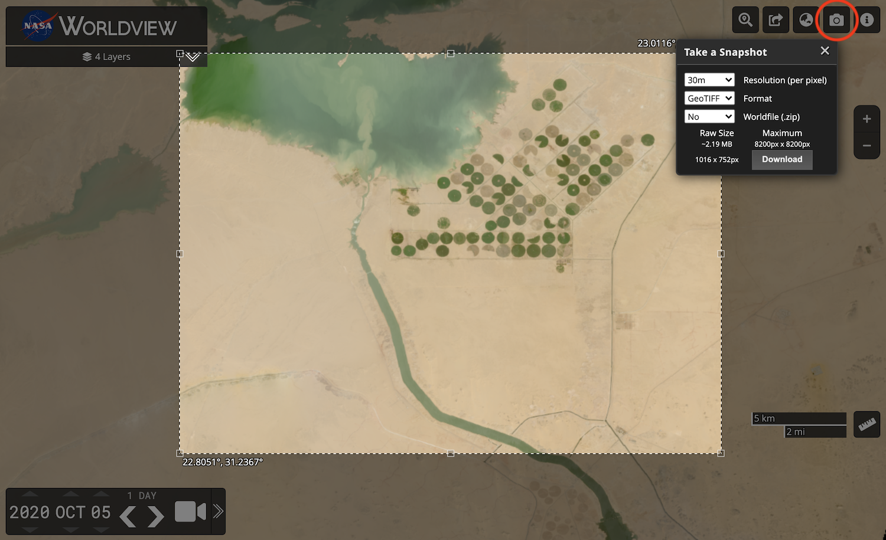
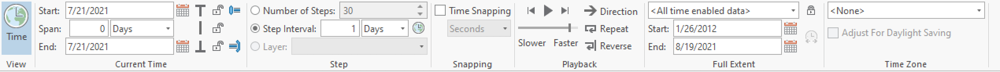

# Accessing via GIS Applications

NASA's Global Imagery Browse Services (GIBS) visualizations are accessible through standards-compliant web services (See [Visualization Services](../access-basics/#access-basics)).  These services, specifically the OGC Web Map Service (WMS) and Web Map Tile Service (WMTS), allow you to access GIBS visualizations directly within many Geographic Information System (GIS) clients.  The information on this page provides instructions for accessing GIBS visualizations through these GIS clients:

* [QGIS](#qgis)
* [ESRI ArcGIS Pro](#esri-arcgis-pro)
* [ESRI ArcGIS/ArcMap](#esri-arcgisarcmap)
* [ESRI ArcGIS Online](#esri-arcgis-online)
* [Google Earth (Web / Pro)](#google-earth-web-pro)

!!! Note
    Some GIS applications do not currently handle time-varying visualizations, especially with WMTS sources. The primary suggested method for access within GIS clients is through WMS as this protocol has better time support.
    Alternatively, [Worldview's](https://worldview.earthdata.nasa.gov/){:target="_blank"} "image snapshot" tool (pictured below) can be used to export imagery as a GeoTIFF or KMZ (or other formats with worldfiles) which can then be imported into your application.

    { width=70% }

 

## QGIS

The [QGIS application](https://qgis.org/){:target="_blank"} supports GIBS' time-varying layers using the WMS protocol.

### Requirements

* QGIS [version 3.14](https://qgis.org/en/site/forusers/visualchangelog314/#temporal){:target="_blank"} or later

### Instructions

* In QGIS, open the "Layer | Add Layer | Add WMS / WMTS Layer" window
* Add a "Name" such as "GIBS WMS (EPSG:4326, Best)"
* Add a "URL" for the [GIBS WMS endpoint](/access-basics/#ogc-web-map-service-wms) of your desired map projection, e.g. one of the following:
[https://gibs.earthdata.nasa.gov/wms/epsg4326/best/wms.cgi](https://gibs.earthdata.nasa.gov/wms/epsg4326/best/wms.cgi) 
[https://gibs.earthdata.nasa.gov/wms/epsg3857/best/wms.cgi](https://gibs.earthdata.nasa.gov/wms/epsg3857/best/wms.cgi) 
[https://gibs.earthdata.nasa.gov/wms/epsg3413/best/wms.cgi](https://gibs.earthdata.nasa.gov/wms/epsg3413/best/wms.cgi) 
[https://gibs.earthdata.nasa.gov/wms/epsg3031/best/wms.cgi](https://gibs.earthdata.nasa.gov/wms/epsg3031/best/wms.cgi)

* Click the "Connect" button to list all available layers for that map projection, select a layer of interest, and "Add" it to the map:

* This should result in a map and legend with your selected layer:

* At this point, you'll need to enable temporal navigation in QGIS to change the currently-displayed date; just above the map area, you can enable either a fixed temporal range or an animated one. For this example, we'll enable a fixed one by clicking the  button.
* In the case of QGIS, the first field (i.e., leftmost) in the date range is what controls the imagery from GIBS.

* Note that each time-enabled layer also has a "clock" button which helpfully takes you to a temporal properties panel for that particular layer.

{ width=50% }

{ width=70% }

 

## ESRI ArcGIS Pro

GIBS imagery layers can be directly loaded into [ESRI ArcGIS Pro](https://www.esri.com/en-us/arcgis/products/arcgis-pro/overview){:target="_blank"} using the WMS protocol.

### Requirements

* ESRI ArcGIS Pro 2.7 or later

### Instructions

1. After starting up ArcGIS Pro, select "Start without a template" from the home page
1. Click the "Insert" tab, "Connections", "New WMS Server" 
{ width=50% }
1. Add a "Server URL" for the [GIBS WMS endpoint](/access-basics/#ogc-web-map-service-wms) of your desired map projection, e.g. one of the following:
[https://gibs.earthdata.nasa.gov/wms/epsg4326/best/wms.cgi](https://gibs.earthdata.nasa.gov/wms/epsg4326/best/wms.cgi) 
[https://gibs.earthdata.nasa.gov/wms/epsg3857/best/wms.cgi](https://gibs.earthdata.nasa.gov/wms/epsg3857/best/wms.cgi) 
[https://gibs.earthdata.nasa.gov/wms/epsg3413/best/wms.cgi](https://gibs.earthdata.nasa.gov/wms/epsg3413/best/wms.cgi) 
[https://gibs.earthdata.nasa.gov/wms/epsg3031/best/wms.cgi](https://gibs.earthdata.nasa.gov/wms/epsg3031/best/wms.cgi)
1. If the "Catalog" pane isn't already open, click the "View" tab and then the "Catalog Pane" button
1. In the Catalog pane, click the triangle next to the "Servers" item which should reveal the "NASA Global Imagery Browse Services (GIBS)" entry; note that you can now add this entry as a favorite by right-clicking on it and "Add to Favorites" which will then allow it to appear in the favorites tab 
{ width=30% }
1. Right-click on a GIBS layer of your choosing ("Aerosol Index (OMPS, Suomi NPP)" is selected above), select "Add To New" and then "Map"; 
1. At this point and depending on the layer you've selected, you should see imagery on the map!  
    * A legend may also be available for your selected layer if you expand the layer item in the Contents pane.  
    * If you don't see imagery yet, you may need to zoom out to see if it's available in another part of the world and/or adjust the currently-selected time as described in the next steps. 
{ width=60% }
1. Since most GIBS imagery is available over many different points in time, you'll now need to enable the time controls to select your date/time of interest.  So once you add a time-varying layer into ArcGIS Pro, a "Time" tab in the top ribbon should now be visible.
{ width=100% }
    * On the right side, notice the “Full Extent” group; the dates listed show the start and stop dates available
    * On the left side in the “Current Time” group:
        * Enter the Start date - this will be the date that you want to display
        * Set the Span to 0
        * The End date should match the Start date after the Span is set to 0
    * In the "Step" group
        * If the "Step Interval" area is grayed out, click the clock icon to the right of the selection
        * Ensure that the radio button next to "Step Interval" is selected and choose your desired time adjustment increment; for most GIBS layers this is set to "1 Days".  That said, there are many other types of layers including geostationary which is generally on a 10 minute interval.  Other layer intervals include 8 days, 1 month, or one year.  You can often deduce this from the GIBS layer name itself which often includes its interval (e.g., "8-day") if it's not a daily product. 
1. Hover over the time display in the top right of the main display area. The times in blue contain data for that period. If the area is white, there is no data available. To advance the time one step, click on the smaller right arrow on the time display or in the “Playback” group. To show an animation, click on the larger right arrow. The control the pace of the animation, in the “Playback” tab adjust the slider labeled “slower – faster”. To reset the time to the current start, move the time icon all the way to the left with your mouse. Note – If you use the mouse to reposition the time icon, be careful to clear the time in “Start” and “End” current time or the data may not display.
{ width=60% }

### Troubleshooting

Here are some common reasons why imagery isn't appearing:

* The current time is not within the full extent period
* The Span is not set to 0
* The step interval of the dataset is not correctly set (e.g. 1 years set instead of 1 days)

 

## ESRI ArcGIS Desktop/ArcMap

GIBS imagery layers can be directly loaded into [ESRI ArcGIS Desktop/ArcMap](https://www.esri.com/en-us/arcgis/products/arcgis-desktop/overview){:target="_blank"} using the WMS protocol.

### Requirements

* ESRI ArcGIS ArcMap 10.2.1 or later (earlier versions are untested, though possibly usable)

### Instructions

* Open the "Catalog" window (far right pane) in ArcMap and select "Add WMS Server"
* Paste one of the [GIBS WMS endpoints](/access-basics/#ogc-web-map-service-wms) (e.g., [WGS84 / Geographic](https://gibs.earthdata.nasa.gov/wms/epsg4326/best/wms.cgi) or [Web Mercator](https://gibs.earthdata.nasa.gov/wms/epsg3857/best/wms.cgi)) into the "URL" field and press the "Get Layers" button to validate the connection.

* Expand the "NASA Global Imagery Browse Services for EOSDIS on gibs.earthdata.nasa.gov" entry in the catalog pane to reveal the list of available layers.

* Drag any layers of interest (VIIRS Corrected Reflectance in this case) into the layer pane at far left:

* Open the Time Slider panel from the toolbar and choose your date of interest.

* Add any other layers in a similar manner.

 

## ESRI ArcGIS Online

GIBS imagery layers can be imported into [ESRI's ArcGIS Online](http://www.arcgis.com/){:target="_blank"} in one of two ways: through the GIBS WMS or as a predefined layer from ESRI.

### Adding GIBS layers via WMS

* Click the "Modify Map" button in the upper right corner, then "Add | Add Layer from Web".

* Change the data type to a WMS OGC Web Service
* Paste one of the [GIBS WMS endpoints](/access-basics/#ogc-web-map-service-wms) (e.g., [WGS84 / Geographic](https://gibs.earthdata.nasa.gov/wms/epsg4326/best/wms.cgi) (e.g., [WGS84 / Geographic](https://gibs.earthdata.nasa.gov/wms/epsg4326/best/wms.cgi) into the "URL" field and press the "Get Layers" button
* Deselect all of the layers (upper left "square") and select a layer you'd like to add

* For each layer that you've loaded, click on the three small dots below "NASA Global Imagery Browse Services for EOSDIS", then "WMS OGC options"
* Add a Parameter for "TIME" and enter a YYYY-MM-DD Value for your desired date; note that this is currently a workaround and should be more directly supported in the future

### Adding GIBS layers from a list of ones predefined by ESRI

* Search for ["Global Imagery Browse Services"](http://www.arcgis.com/home/search.html?q=Global%20Imagery%20Browse%20Services&t=content){:target="_blank"} in ArcGIS Online and add individual results to your map, such as [Aqua/MODIS Corrected Reflectance (True Color)](http://www.arcgis.com/home/item.html?id=10739eefdc9743a2b884bebe4b3476d7){:target="_blank"}.
* To change the currently-displayed date, go to the "Details" pane, then click the small down arrow next to the layer name. Click "Enable Time Animation", then adjust the date at the bottom of the page.

 

## Google Earth (Web / Pro)

The [web-based Google Earth](https://earth.google.com/web/){:target="_blank"} and [desktop Google Earth Pro](https://www.google.com/earth/versions/#earth-pro){:target="_blank"} support loading of KML/KMZ files which allows you to import GIBS imagery via Worldview's KMZ download capability.

### Generate/Download KMZ file from Worldview

* Start in [Worldview](https://worldview.earthdata.nasa.gov/){:target="_blank"} to find your imagery of interest.
    * Use Worldview's "camera tool" in the upper right corner to select an image to download and choose the "KMZ" format
    * Click "Download" and save the KMZ file to your computer

### Loading a KMZ into Google Earth (Web)

* Open [Google Earth (Web)](https://earth.google.com/web/){:target="_blank"}
    * Click the "hamburger" button (three horizontal lines in the upper left), go to Projects, and click "Import KML from computer"
    * Select the KMZ file that you just downloaded from Worldview

### Loading a KMZ into Google Earth Pro (Desktop)

* Launch [Google Earth Pro](https://www.google.com/earth/versions/#earth-pro){:target="_blank"}
    * Go the the "File" menu and click "Open..." 
    * Select the KMZ file that you just downloaded from Worldview

