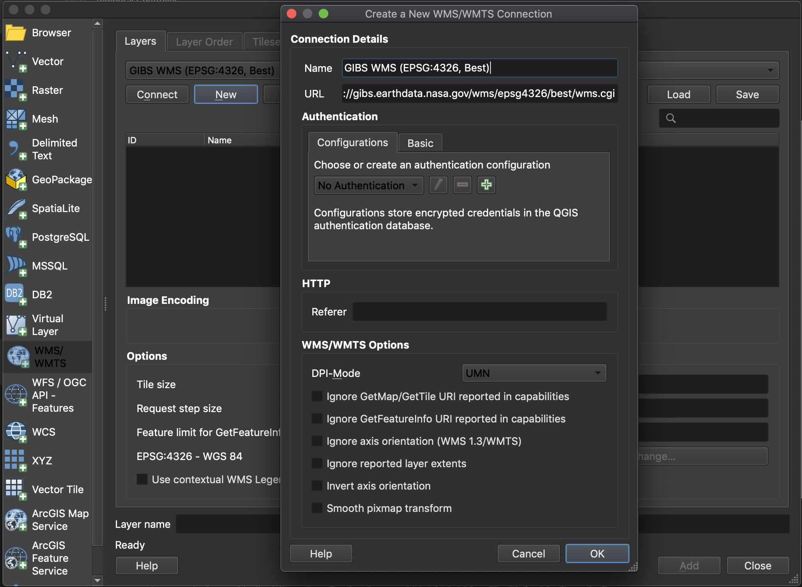
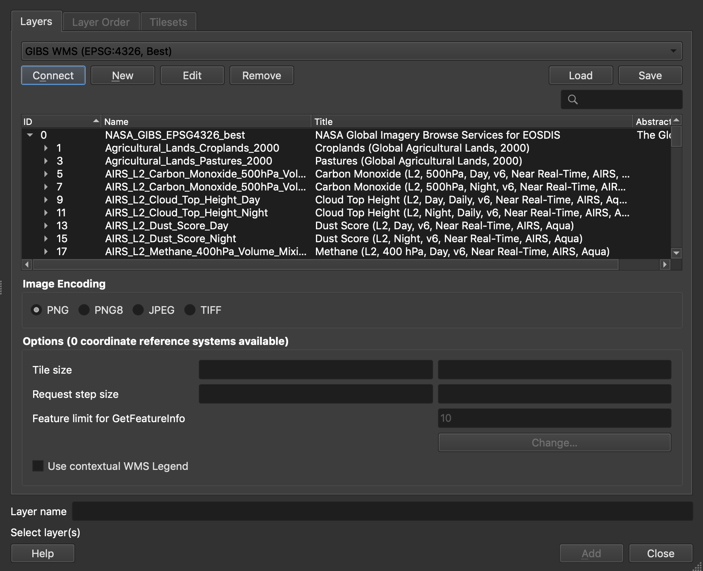
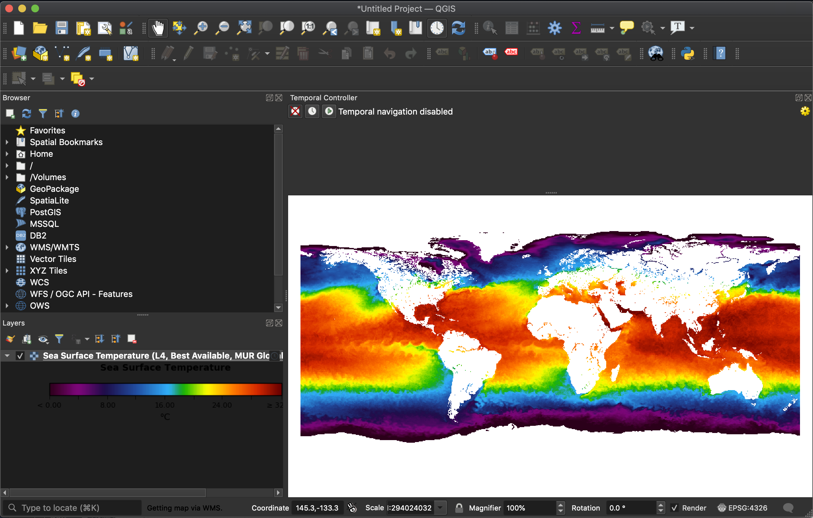
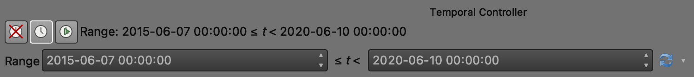
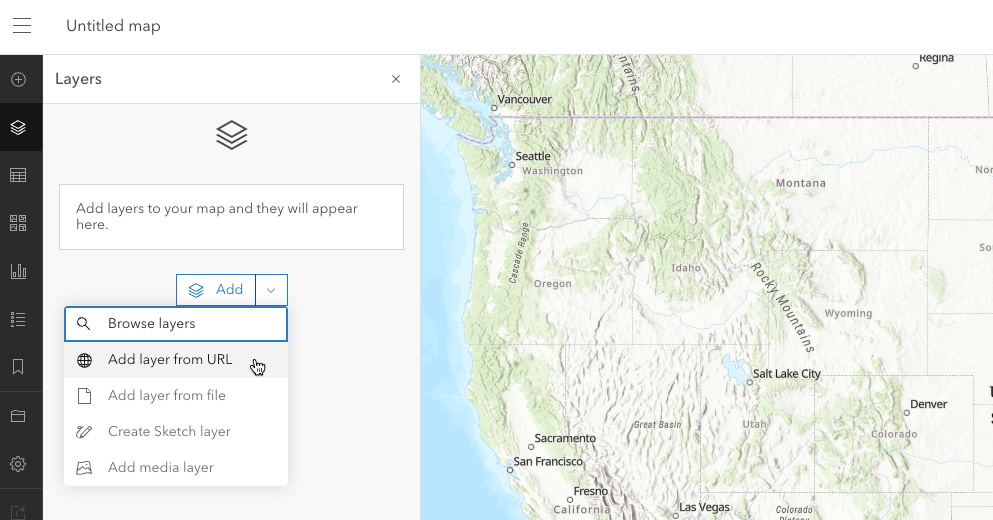
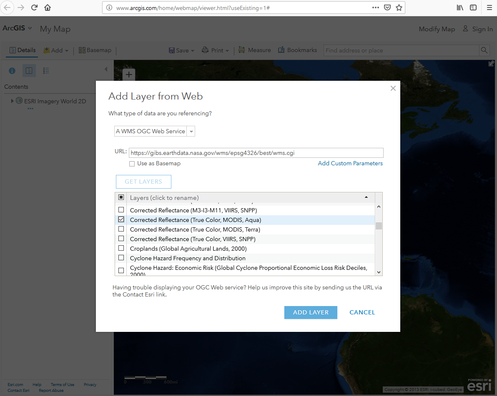
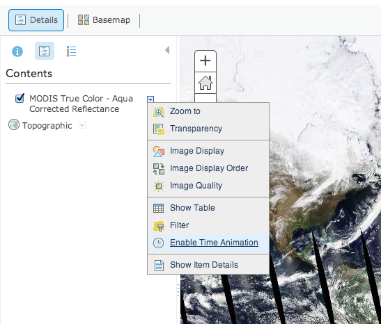

# Geographic Information System (GIS) Usage

Through the OGC Web Map Service (WMS) and Web Map Tile Service (WMTS), it's often possible to access imagery directly from NASA's Global Imagery Browse Services (GIBS) from your favorite Geographic Information System (GIS) client.

Please note: some existing GIS applications do not currently handle time-varying imagery layers, especially with WMTS sources.  The primary suggested method for access within GIS clients is through WMS as this protocol has better time support.  Alternatively, [Worldview's](https://worldview.earthdata.nasa.gov/) "image capture" tool (camera icon in upper right) can be used to export imagery as a GeoTIFF or KMZ (or other formats with worldfiles) which can then be imported into your application.

## QGIS

The QGIS application supports GIBS' time-varying layers using the WMS protocol.

**Requirements**

- QGIS version 3.14 or later

**Instructions**

- In QGIS, open the "Layer | Add Layer | Add WMS / WMTS Layer" window
- Add a "Name" such as "GIBS WMS (EPSG:4326, Best)"
- Add a "URL" for the [GIBS WMS endpoint](https://wiki.earthdata.nasa.gov/display/GIBS/GIBS+API+for+Developers#GIBSAPIforDevelopers-OGCWebMapService(WMS)) of your desired map projection, e.g. one of the following:  
[https://gibs.earthdata.nasa.gov/wms/epsg4326/best/wms.cgi](https://gibs.earthdata.nasa.gov/wms/epsg4326/best/wms.cgi)  
[https://gibs.earthdata.nasa.gov/wms/epsg3857/best/wms.cgi](https://gibs.earthdata.nasa.gov/wms/epsg3857/best/wms.cgi)  
[https://gibs.earthdata.nasa.gov/wms/epsg3413/best/wms.cgi](https://gibs.earthdata.nasa.gov/wms/epsg3413/best/wms.cgi)  
[https://gibs.earthdata.nasa.gov/wms/epsg3031/best/wms.cgi](https://gibs.earthdata.nasa.gov/wms/epsg3031/best/wms.cgi)

- Click the "Connect" button to list all available layers for that map projection, select a layer of interest, and "Add" it to the map:

- This should result in a map and legend with your selected layer:

- At this point, you'll need to enable temporal navigation in QGIS to change the currently-displayed date; just above the map area, you can enable either a fixed temporal range or an animated one.  For this example, we'll enable a fixed one by clicking the  button.
- In the case of QGIS, the first field (i.e., leftmost) in the date range is what controls the imagery from GIBS.

## ESRI ArcGIS/ArcMap
GIBS imagery layers can be directly imported into ESRI ArcGIS/ArcMap 10.2.1 or later using the WMS protocol.

**Requirements**

- ESRI ArcGIS ArcMap 10.2.1 or later (earlier versions are untested, though possibly usable)

**Instructions**

- Open the "Catalog" window (far right pane) in ArcMap and select "Add WMS Server"
- Paste one of the [GIBS WMS endpoints](http://127.0.0.1:8000/#ogc-web-map-service-wms) (e.g., [WGS84 / Geographic](https://gibs.earthdata.nasa.gov/wms/epsg4326/best/wms.cgi)) into the "URL" field and press the "Get Layers" button to validate the connection.

- Expand the "NASA Global Imagery Browse Services for EOSDIS on gibs.earthdata.nasa.gov" entry in the catalog pane to reveal the list of available layers.

- Drag any layers of interest (VIIRS Corrected Reflectance in this case) into the layer pane at far left:

- Open the Time Slider panel from the toolbar and choose your date of interest.

- Add any additional layers in a similar manner.

## ESRI ArcGIS Online
GIBS imagery layers can be imported into [ESRI's ArcGIS Online](http://www.arcgis.com/) in one of two ways: through the GIBS WMS or as a predefined layer from ESRI.

**Adding GIBS layers via WMS**
- Click the "Modify Map" button in the upper right corner, then "Add | Add Layer from Web".

- Change the data type to a WMS OGC Web Service
- Paste one of the GIBS WMS endpoints (e.g., [WGS84 / Geographic](https://gibs.earthdata.nasa.gov/wms/epsg4326/best/wms.cgi) into the "URL" field and press the "Get Layers" button
- Deselect all of the layers (upper left "square") and select a layer you'd like to add

- For each layer that you've loaded, click on the three small dots below "NASA Global Imagery Browse Services for EOSDIS", then "WMS OGC options"
- Add a Parameter for "TIME" and enter a YYYY-MM-DD Value for your desired date

**Adding GIBS layers from a list of ones predefined by ESRI**

- Search for ["Global Imagery Browse Services"](http://www.arcgis.com/home/search.html?q=Global%20Imagery%20Browse%20Services&t=content) in ArcGIS Online and add individual results to your map, such as [Aqua/MODIS Corrected Reflectance (True Color)](http://www.arcgis.com/home/item.html?id=10739eefdc9743a2b884bebe4b3476d7).
- To change the currently-displayed date, go to the "Details" pane, then click the small down arrow next to the layer name. Click "Enable Time Animation", then adjust the date at the bottom of the page.

## Google Earth (Web)
The [web-based Google Earth](https://earth.google.com/web/) experimentally supports loading of KML/KMZ files which allows you to import GIBS imagery via Worldview's KMZ download capability.

**Usage (Generate/Download KMZ file)**

- Start in [Worldview](https://worldview.earthdata.nasa.gov/) to find your imagery of interest.
    - Use Worldview's "camera tool" in the upper right corner to select an image to download and choose the "KMZ" format
    - Click "Download" and save the KMZ file to your computer

- Open [Google Earth](https://earth.google.com/web/)
    - Click the "hamburger" button (three horizontal lines in the upper left), and go to Settings; turn on the "Enable KML File Import" setting
    - Click the "hamburger" button again, and go to "My Places"; click the "Import KML File" button and "Open File..."
    - Select the KMZ file that you just downloaded from Worldview

Limitations:

As of this writing, the KML files generated by GIBS aren't supported by the web-based version of Google Earth.

## Google Earth Pro (Desktop)

GIBS can generate KML files to be used with Google Earth Pro. Those KMLs include pointers to GIBS imagery via the NetworkLink keyword. Users have two options on loading KML files into Google Earth Pro as described below.

**Requirements**

- [Google Earth Pro standalone client](https://www.google.com/earth/versions/#earth-pro)

**Usage (Generate/Download KML file)**

Using the [information on generating KMLs](https://wiki.earthdata.nasa.gov/display/GIBS/GIBS+API+for+Developers#GIBSAPIforDevelopers-GoogleEarthKMLAccess), you can load that downloaded file from within Google Earth (File | Open) or usually by simply double-clicking on the KML file itself. The layer will show up in the "Temporary Places" within the "Places" window.

**Usage (Load from within Google Earth Pro)**

After launching Google Earth Pro, choose the "Network Link" item from the "Add" menu. Choose whatever Name you wish and in the "Link" field, insert the appropriate link (e.g., [https://gibs.earthdata.nasa.gov/twms/epsg4326/best/kmlgen.cgi?layers=MODIS_Terra_CorrectedReflectance_TrueColor&time=2012-06-21](https://gibs.earthdata.nasa.gov/twms/epsg4326/best/kmlgen.cgi?layers=MODIS_Terra_CorrectedReflectance_TrueColor&time=2012-06-21)). Check the [list of available layers](https://wiki.earthdata.nasa.gov/display/GIBS/GIBS+Available+Imagery+Products). Find more details on how to compose a proper [KML generation request from the GIBS server](https://wiki.earthdata.nasa.gov/display/GIBS/GIBS+API+for+Developers#GIBSAPIforDevelopers-GoogleEarthKMLAccess).

Limitations (both methods):

Due to the way NetworkLink is handled in Google Earth Pro for global datasets, you may need to zoom out to a more "global" view before imagery begins loading.

When using a KML that contains multiple time steps, the time slider by default usually attempts to display the entire time range simultaneously; this can cause a Z-fighting problem where all time steps are fighting to be shown. To correct the problem, narrow the range of currently-shown time to a single day using the time widget.