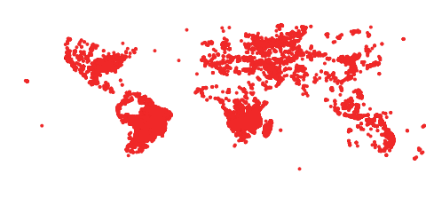

# Overview

The Global Imagery Browse Services (GIBS) are designed to deliver global, full-resolution satellite imagery to users in a highly responsive manner,
enabling interactive exploration of the Earth. To achieve that interactivity, GIBS first ingests imagery from a given NASA data provider on a
continuous basis, creates a global mosaic of that imagery, then chops the mosaic into an image tile pyramid (see figure below). By pre-generating
these tiles, it relieves the servers of image rescaling and cropping duties, greatly reducing computational overhead and enabling a highly responsive
system. This also means that the primary method of imagery retrieval for clients is tile-based. For more background on how tiled web maps work, see
the [MapBox Developers Guide](https://www.mapbox.com/help/how-web-maps-work/).


An image tile pyramid (from OGC WMTS 1.0.0 specification)


While the requests made to GIBS are for individual tiles, users generally work at a higher level and configure a [map library](https://wiki.earthdata.nasa.gov/display/GIBS/Map+Library+Usage), [GIS client](https://wiki.earthdata.nasa.gov/display/GIBS/Geographic+Information+System+%28GIS%29+Usage), or [script](https://wiki.earthdata.nasa.gov/display/GIBS/GIBS+API+for+Developers#GIBSAPIforDevelopers-Script-levelAccessviaGDAL) to
determine which tiles to retrieve. These clients and scripts need to know which products are available, which map projections are available, and how
many zoom levels they support. GIBS provides this access through five mechanisms:

1. An Open Geospatial Consortium (OGC) **Web Map Tile Service (WMTS)** which supports key-value-pair and RESTful tiled requests
2. An Open Geospatial Consortium (OGC) **Web Map Service (WMS)** which supports a key-value-pair non-tiled requests
3. A **Tiled Web Map Service (TWMS)**, an unofficial extension to the OGC Web Map Service (WMS), which supports key-value-pair tiled
requests that match the exact geographic tile boundaries
4. Script-level access through the **Geospatial Data Abstraction Library (GDAL)**

The implementation of these services is built from the long-running "OnEarth" server system at NASA/JPL.

Access to GIBS via OGC WMTS, OGC WMS, Tiled WMS, and GDAL is described below.

In addition, source code for the GIBS tiled imagery server and tiled imagery storage format is available. See [this blog post](https://wiki.earthdata.nasa.gov/display/GIBS/2014/02/04/OnEarth+and+MRF+Now+Available+on+GitHub) for more info along with the
[code on GitHub](https://github.com/nasa-gibs/onearth).


# Imagery Layers & Endpoints

GIBS imagery layers are named and made available through a set of defined endpoints based on the following characteristics:

1. **Projection & Resolution** - Imagery layers are available in one or more projected coordinate systems (e.g. EPSG:4326 - "Geographic Lat/Lon")
at a specific resolution (e.g. 2km/pixel)
2. **Near Real-Time vs Standard Latency** - Imagery layers are available in a near real-time (e.g. within 3 hours of observation) or standard (e.g.
within X days of observation) latency.
3. **Data Version** - Imagery layers may be available for more than one version (e.g. MODIS v5 and v6) of the same science parameter.

You will note in the list of [available GIBS products](https://wiki.earthdata.nasa.gov/display/GIBS/GIBS+Available+Imagery+Products), that there are columns for "Projection(s)" and "Resolution", which correspond to the information
provided below. GIBS services additionally provide machine-readable documents (e.g. WMTS "Get Capabilities") that provide specific information
regarding all available imagery layers.

For GIBS service endpoints, additional DNS entries are available as a way to circumvent simultaneous connection limits of the web browser (as
described here ). The additional DNS entries are [https://gibs-a.earthdata.nasa.gov](https://gibs-a.earthdata.nasa.gov), [https://gibs-b.earthdata.nasa.gov](https://gibs-b.earthdata.nasa.gov), and [https://gibs-c.earthdata](https://gibs-c.earthdata).
nasa.gov. Please note that these are not additional servers, simply aliases for the [https://gibs.earthdata.nasa.gov](https://gibs.earthdata.nasa.gov) domain.

The remainder of this section provides additional details regarding how GIBS imagery layers are named and made available through service
endpoints. These details provide a thorough description of the available configurations of the GIBS imagery layers. Outside of this section, this page
will reference only the "Best Available" imagery layers and endpoints, described below, for simplicity.

## Layer Naming

GIBS imagery layer identifiers follow a human-readable convention (e.g. MODIS_Terra_Aerosol_Optical_Depth_v6_STD) to simplify situations where
manual parsing of service documentation (e.g. WMTS GetCapabilities) is performed. Identifiers include uniquely identifying information like the
following items:

- **Science Parameter** - The science parameter that is being visualized (e.g. "Aerosol Optical Depth")
- **Processing Level** - The processing level of the associated data (e.g. "L3" or "L2")
- **Data Period** - The period of the available imagery products (e.g. "Monthly")
- **Data Version** - The version of the associated data product (e.g. "v6")
- **Data Latency** - The latency of the associated data product (e.g. "STD" or "NRT")
- **Instrument/Platform** - The Instrument and Platform responsible for collecting the visualized data (e.g. "MODIS / Terra").

The following are examples of imagery layer identifiers for the "Aerosol Optical Depth" science parameter collected by the MODIS instrument on the
Terra platform. In this example, imagery layers exist for a combination of data versions and latencies. The first item is considered the "Best Available"
layer, which is described further in the following section.

Example layer names are listed below:
- MODIS_Terra_Aerosol_Optical_Depth
- MODIS_Terra_Aerosol_Optical_Depth_v6_NRT
- MODIS_Terra_Aerosol_Optical_Depth_v6_STD
- MODIS_Terra_Aerosol_Optical_Depth_v5_NRT

## "Best Available" Layers

As has been discussed, imagery layers visualizing the same science parameter from a specific instrument and platform may be available for multiple
versions and/or data latencies. Direct access to those various flavors of the same visualization are directly available. However, many users are
simply interested in seeing a consistent "best available" imagery layer. The details of what is "best" being determined by the GIBS team. Therefore,
GIBS provides a unique set of "Best Available" imagery layers for all of its imagery layers, abstracting away the individual versions and latencies. A
similar naming convention is used, as described in the previous section, but identifiers do not specify the version or latency (e.g.
MODIS_Terra_Aerosol_Optical_Depth).


For each "best available" layer, the "best" image will be determined based on
the evaluation of availability for following imagery products:


1. Latest Version Standard Product 
2. Latest Version NRT
3. Previous Version Standard Product
4. Previous Version NRT


See the image above for a visual example. The top four bars show the
temporal coverage of related imagery products. The bottom bar shows the
imagery products that will be returned based on the "best available"
determination. 

## Projections & Resolution

GIBS supports imagery products in the following projections. In order to facilitate the pre-generation of tiled imagery, GIBS has selected a set of
resolutions within each projection.

- EPSG:4326 - Lat-lon / Geographic / WGS 84
- EPSG:3857 - Web Mercator / Spherical Mercator / "Google Projection"
- EPSG:3413 - NSIDC Sea Ice Polar Stereographic North
- EPSG:3031 - Antarctic Polar Stereographic / WGS 84

When developing new imagery layers, GIBS works with the imagery providers to determine the "appropriate" projections and resolution. The following
guidelines will help you access these layers:

1. Imagery layers may not be available in all projections.
2. Imagery layers available in multiple projections utilize the same identifiers.
3. Imagery layers available in the EPSG:4326, EPSG:3413, and EPSG:3031 projections are provided at the same resolution.
4. Imagery layers available in the EPSG:4326 "Geographic" projection are available in the EPSG:3857 "Web Mercator" projection.
    - Note: Some of the non-data (e.g. coastlines, land mask) may not be available in EPSG:3857.

For each projection and resolution, a certain number of zoom levels are available for tiled access services (i.e. WMTS and TWMS). Each zoom level
corresponds to a "power of 2" zoom in/out from the previous/next level. This information can be used to configure your map client to work with
GIBS. Note that the GIBS spatial coverage of the Geographic and Web Mercator projections match the full extent of the projections, as defined by the
EPSG. The GIBS spatial coverages of the north and south polar projections are a subset of the full projection extent, as defined by the EPSG. The
GIBS' extents were selected to a) cover the main land/ice masses at each pole and b), to ensure that the full resolution image has a resolution and
pixel height/width that are a power of two as required for tiled access and zooming.

The following subsections provide additional information regarding the GIBS projections and their available resolutions:

#### WGS 84 / Lat-lon / Geographic (EPSG:4326)
 

Resolution (per pixel)| Tile Matrix Set (WMTS) | # Zoom Levels | Max Resolution (deg/pixel) | Min Resolution (deg/pixel)
---------------------- | --------------------- | -------------- | --------------------------| --------------------------
15.125m | 15.125m | 13 | 0.5625 | 0.0001373291015625
31.25m | 31.25m |12| 0.5625| 0.000274658203125
250m | 250m | 9 | 0.5625 | 0.002197265625
500m | 500m | 8 | 0.5625 | 0.00439453125
1km | 1km | 7 | 0.5625 | 0.0087890625
2km | 2km | 6 | 0.5625 | 0.017578125


#### Web Mercator (EPSG:3857)
 

Resolution (per pixel)| Tile Matrix Set (WMTS) | # Zoom Levels | Max Resolution (deg/pixel) | Min Resolution (deg/pixel)
------------------- | --------------------- | -------------- | --------------------------| --------------------------
19.10925707129405m | GoogleMapsCompatible_Level13 | 13 | 156543.03390625 | 19.10925707129405
38.21851414258810m | GoogleMapsCompatible_Level12 | 12 | 156543.03390625 | 38.21851414258810
305.7481131407048m | GoogleMapsCompatible_Level9  | 9 | 156543.03390625 | 305.7481131407048
611.4962262814100m | GoogleMapsCompatible_Level8  | 8 | 156543.03390625 | 611.4962262814100
1222.992452562820m | GoogleMapsCompatible_Level7  | 7 | 156543.03390625 | 1222.992452562820
2445.984905125640m | GoogleMapsCompatible_Level6  | 6 | 156543.03390625 | 2445.984905125640

#### NSIDC Sea Ice Polar Stereographic North (EPSG:3413)
 

Resolution (per pixel)| Tile Matrix Set (WMTS) | # Zoom Levels | Max Resolution (deg/pixel) | Min Resolution (deg/pixel)
------------------- | --------------------- | -------------- | --------------------------| --------------------------
250m | 250m | 6 | 8192.0 | 256.
500m | 500m | 5 | 8192.0 | 512.
1km  | 1km  | 4 | 8192.0 | 1024.
2km  | 2km  | 3 | 8192.0 | 2048.


#### Antarctic Polar Stereographic (EPSG:3031)
 

Resolution (per pixel)| Tile Matrix Set (WMTS) | # Zoom Levels | Max Resolution (deg/pixel) | Min Resolution (deg/pixel)
------------------- | --------------------- | -------------- | --------------------------| --------------------------
250m | 250m | 6 | 8192.0 | 256.0
500m | 500m | 5 | 8192.0 | 512.0
1km  | 1km  | 4 | 8192.0 | 1024.0
2km  | 2km  | 3 | 8192.0 | 2048.0

## Service Endpoints

GIBS imagery layers are made available through standard access methods, described in a following section of this page. Where applicable, those
services have multiple "endpoints" that contain a specific set of GIBS imagery layers. The endpoints are scoped using the following items:

1. Service - Either the WMTS, WMS, or TWMS specification.
2. Projection - The EPSG code for the appropriate projection.
3. Type - The "type" of imagery layers available in the endpoint. Valid values include:
    a. best - The "Best Available" imagery products.
    b. std - Standard imagery products only.
    c. nrt - Near Real-Time imagery products only.
    d. all - All Best Available, Standard, and Near Real-Time imagery products.

The pattern for a GIBS service endpoint is shown below. Parameterized elements of the pattern are provided in \{paramter:value1[|value2]*\} notation.

`https://gibs.earthdata.nasa.gov/{service:wmts|wms|twms}/epsg{code:4326|3857|3413|3031}/{type:
all|best|nrt|std}`

The following table provides some sample endpoints for various unique combinations:


Service | EPSG | Type | Sample Endpoint
------- | ---- | ---- | ---------------
WMTS | 4326 | all | https://gibs.earthdata.nasa.gov/wmts/epsg4326/all/
WMS | 3857 | best | https://gibs.earthdata.nasa.gov/wms/epsg3857/best/
TWMS | 3413 | nrt | https://gibs.earthdata.nasa.gov/twms/epsg3413/nrt/


# Imagery API/Services

## OGC Web Map Tile Service (WMTS)

The [Open Geospatial Consortium (OGC) Web Map Tile Service (WMTS)](http://www.opengeospatial.org/standards/wmts/) provides a way for clients to retrieve tiled mapping data in a standardized
manner, handling product-specific details such as available number of zoom levels, map projections, image formats, tile sizes, etc. The WMTS
specification provides guidance for three methods of tile retrieval: Key-Value Pair (KVP), REpresentational State Transfer (REST), and Simple Object
Access Protocol (SOAP). GIBS supports KVP and REST, but not SOAP.

#### Service Endpoints and GetCapabilities

The WMTS specification requires that a WMTS server provide information regarding the available imagery via a GetCapabilities request.
Here is a list of available service endpoints, projections, and their GetCapabilities request:

* WGS 84 / Geographic - EPSG:4326, WMTS version 1.0.
    * KVP endpoint: [https://gibs.earthdata.nasa.gov/wmts/epsg4326/best/wmts.cgi](https://gibs.earthdata.nasa.gov/wmts/epsg4326/best/wmts.cgi)
    * KVP GetCapabilities: [https://gibs.earthdata.nasa.gov/wmts/epsg4326/best/wmts.cgi?SERVICE=WMTS&request=GetCapabilities](https://gibs.earthdata.nasa.gov/wmts/epsg4326/best/wmts.cgi?SERVICE=WMTS&request=GetCapabilities)
    * REST endpoint: [https://gibs.earthdata.nasa.gov/wmts/epsg4326/best/](https://gibs.earthdata.nasa.gov/wmts/epsg4326/best/)
    * REST GetCapabilities: [https://gibs.earthdata.nasa.gov/wmts/epsg4326/best/1.0.0/WMTSCapabilities.xml](https://gibs.earthdata.nasa.gov/wmts/epsg4326/best/1.0.0/WMTSCapabilities.xml)
* Web Mercator - EPSG:3857, WMTS version 1.0.
    * KVP endpoint: [https://gibs.earthdata.nasa.gov/wmts/epsg3857/best/wmts.cgi](https://gibs.earthdata.nasa.gov/wmts/epsg3857/best/wmts.cgi)
    * KVP GetCapabilities: [https://gibs.earthdata.nasa.gov/wmts/epsg3857/best/wmts.cgi?SERVICE=WMTS&request=GetCapabilities](https://gibs.earthdata.nasa.gov/wmts/epsg3857/best/wmts.cgi?SERVICE=WMTS&request=GetCapabilities)
    * REST endpoint: [https://gibs.earthdata.nasa.gov/wmts/epsg3857/best/](https://gibs.earthdata.nasa.gov/wmts/epsg3857/best/wmts.cgi?SERVICE=WMTS&request=GetCapabilities)
    * REST GetCapabilities: [https://gibs.earthdata.nasa.gov/wmts/epsg3857/best/1.0.0/WMTSCapabilities.xml](https://gibs.earthdata.nasa.gov/wmts/epsg3857/best/1.0.0/WMTSCapabilities.xml)
* Arctic polar stereographic - EPSG:3413, WMTS version 1.0.
    * KVP endpoint: [https://gibs.earthdata.nasa.gov/wmts/epsg3413/best/wmts.cgi](https://gibs.earthdata.nasa.gov/wmts/epsg3413/best/wmts.cgi)
    * KVP GetCapabilities: [https://gibs.earthdata.nasa.gov/wmts/epsg3413/best/wmts.cgi?SERVICE=WMTS&request=GetCapabilities](https://gibs.earthdata.nasa.gov/wmts/epsg3413/best/wmts.cgi?SERVICE=WMTS&request=GetCapabilities)
    * REST endpoint: [https://gibs.earthdata.nasa.gov/wmts/epsg3413/best/](https://gibs.earthdata.nasa.gov/wmts/epsg3413/best/)
    * REST GetCapabilities: [https://gibs.earthdata.nasa.gov/wmts/epsg3413/best/1.0.0/WMTSCapabilities.xml](https://gibs.earthdata.nasa.gov/wmts/epsg3413/best/1.0.0/WMTSCapabilities.xml)
* Antarctic polar stereographic - EPSG:3031, WMTS version 1.0.
    * KVP endpoint: [https://gibs.earthdata.nasa.gov/wmts/epsg3031/best/wmts.cgi](https://gibs.earthdata.nasa.gov/wmts/epsg3031/best/wmts.cgi)
    * KVP GetCapabilities: [https://gibs.earthdata.nasa.gov/wmts/epsg3031/best/wmts.cgi?SERVICE=WMTS&request=GetCapabilities](https://gibs.earthdata.nasa.gov/wmts/epsg3031/best/wmts.cgi?SERVICE=WMTS&request=GetCapabilities)
    * REST endpoint: [https://gibs.earthdata.nasa.gov/wmts/epsg3031/best/](https://gibs.earthdata.nasa.gov/wmts/epsg3031/best/)
    * REST GetCapabilities: [https://gibs.earthdata.nasa.gov/wmts/epsg3031/best/1.0.0/WMTSCapabilities.xml](https://gibs.earthdata.nasa.gov/wmts/epsg3031/best/1.0.0/WMTSCapabilities.xml)

#### Time Dimension


The core concept within the GetCapabilities response is a map layer. GIBS map layers represent data that changes over time, most
commonly providing a different map each day. Therefore, the layer definition within the GIBS GetCapabilities response must present a
time dimension. The GIBS team has chosen to address this in the following manner, within each layer:
```
<Dimension>
  <ows:Identifier>time</ows:Identifier>
  <UOM>ISO8601</UOM>
  <Default>2013-05-29</Default>
  <Current>false</Current>
  <Value>2012-05-08/2013-05-29/P1D</Value>
</Dimension>
```

The parts of the Dimension data structure are taken from the WMTS 1.0.0 spec (Table 9, p. 22). However, since the WMTS spec
doesn't address the time dimension, we are adapting some aspects of the WMS spec regarding the time dimension, specifically:

1. The contents of the `<UOM>` part match the contents of the "units=" attribute in the WMS `<Dimension>` element.
2. The contents of the `<Value>` part match the contents of the WMS `<Extent>` element.

If the time dimension is omitted in the WMTS request, GIBS will return tiles for the default date, as specified in the `<Default>` tag. Note
that GIBS' imagery layers all have a value of false in the `<Current>` tag which means that the special current keyword cannot be provided
as the time value. However, GIBS does support use of the special default keyword, which results in the same response as though the
date were omitted.


#### Sample Execution

GIBS has chosen to implement the Key-Value Pair and RESTful service interfaces. Equivalent sample requests are included below:

- KVP - [https://gibs.earthdata.nasa.gov/wmts/epsg4326/best/wmts.cgi?SERVICE=WMTS&REQUEST=GetTile&VERSION=1.0.0&LAYER=MODIS_Terra_CorrectedReflectance_TrueColor&STYLE=&TILEMATRIXSET=250m&TILEMATRIX=6&TILEROW=13&TILECOL=36&FORMAT=image%2Fjpeg&TIME=2012-07-09](https://gibs.earthdata.nasa.gov/wmts/epsg4326/best/wmts.cgi?SERVICE=WMTS&REQUEST=GetTile&VERSION=1.0.0&LAYER=MODIS_Terra_CorrectedReflectance_TrueColor&STYLE=&TILEMATRIXSET=250m&TILEMATRIX=6&TILEROW=13&TILECOL=36&FORMAT=image%2Fjpeg&TIME=2012-07-09)
- RESTful - [https://gibs.earthdata.nasa.gov/wmts/epsg4326/best/MODIS_Terra_CorrectedReflectance_TrueColor/default/2012-07-09/250m/6/13/36.jpg](https://gibs.earthdata.nasa.gov/wmts/epsg4326/best/MODIS_Terra_CorrectedReflectance_TrueColor/default/2012-07-09/250m/6/13/36.jpg)

More generically, the RESTful request follows the form of:

`https://gibs.earthdata.nasa.gov/wmts/epsg{EPSG:Code}/best/{ProductName}/default/{Time}/{TileMatrixSet}/{ZoomLevel}/{TileRow}/{TileCol}.png`

#### Example Clients

- [NASA Worldview](https://earthdata.nasa.gov/worldview)
- [OpenLayers v2 and v3, Leaflet, Bing Maps, Google Maps](https://github.com/nasa-gibs/gibs-web-examples)

## Generic XYZ Tile Access


The WMTS RESTful interface above can be easily adapted for use as a "generic" XYZ tile server if the developer pre-populates all of the
required fields except the tile row, column, and zoom level. For example, by starting with the most generalized GIBS API request:

`https://gibs.earthdata.nasa.gov/wmts/epsg{EPSG:Code}/best/{ProductName}/default/{Time}/{TileMatrixSet}/{ZoomLevel}/{TileRow}/{TileCol}.png`

Populating the fields with the desired projection, product, time, etc (Terra/MODIS Aerosol Optical depth from 2014/04/09, in this case), GIBS
products can be used by clients such as ESRI's ArcGIS Online to add a "Tile Layer" by leaving the row, column, and zoom level as parameters:

`https://gibs.earthdata.nasa.gov/wmts/epsg3857/best/MODIS_Terra_Aerosol/default/2014-04-09/GoogleMapsCompatible_Level6/{level}/{row}/{col}.png`


## OGC Web Map Service (WMS)

The [Open Geospatial Consortium (OGC) Web Map Service (WMS)](http://www.opengeospatial.org/standards/wms/) provides a way for clients to receive a customized WMS response based on
request parameters such as a custom bounding box, dimensions, layer(s) and format. Unlike the rigidity enforced through tiled interfaces (e.g. WMTS
and TWMS), WMS responses are more flexible and may contain multiple composited layers in a single output. Two WMS specifications are currently
available and supported by GIBS: 1.1.1 and 1.3.0. Both WMS specifications support a single method of image retrieval, which is supported by GIBS:
Key-Value Pair (KVP).

#### Service Endpoints and GetCapabilities

The WMS specification requires that a WMS server provide information regarding the available imagery via a GetCapabilities request. H
ere is a list of available service endpoints, projections, and their GetCapabilities request:

* WGS 84 / Geographic - EPSG:
    * WMS endpoint: [https://gibs.earthdata.nasa.gov/wms/epsg4326/best/wms.cgi](https://gibs.earthdata.nasa.gov/wms/epsg4326/best/wms.cgi)
    * WMS v1.1.1 GetCapabilities: [https://gibs.earthdata.nasa.gov/wms/epsg4326/best/wms.cgi?SERVICE=WMS&REQUEST=GetCapabilities&VERSION=1.1.1](https://gibs.earthdata.nasa.gov/wms/epsg4326/best/wms.cgi?SERVICE=WMS&REQUEST=GetCapabilities&VERSION=1.1.1)
    * WMS v1.3.0 GetCapabilities: [https://gibs.earthdata.nasa.gov/wms/epsg4326/best/wms.cgi?SERVICE=WMS&REQUEST=GetCapabilities&VERSION=1.3.0](https://gibs.earthdata.nasa.gov/wms/epsg4326/best/wms.cgi?SERVICE=WMS&REQUEST=GetCapabilities&VERSION=1.3.0)
* Web Mercator - EPSG:3857
    * WMS endpoint: https://gibs.earthdata.nasa.gov/wms/epsg3857/best/wms.cgi
    * WMS v1.1.1 GetCapabilities: [https://gibs.earthdata.nasa.gov/wms/epsg3857/best/wms.cgi?SERVICE=WMS&REQUEST=GetCapabilities&VERSION=1.1.1](https://gibs.earthdata.nasa.gov/wms/epsg3857/best/wms.cgi?SERVICE=WMS&REQUEST=GetCapabilities&VERSION=1.1.1)
    * WMS v1.3.0 GetCapabilities: [https://gibs.earthdata.nasa.gov/wms/epsg3857/best/wms.cgi?SERVICE=WMS&REQUEST=GetCapabilities&VERSION=1.3.0](https://gibs.earthdata.nasa.gov/wms/epsg3857/best/wms.cgi?SERVICE=WMS&REQUEST=GetCapabilities&VERSION=1.3.0)
* Arctic polar stereographic - EPSG:3413
    * WMS endpoint: [https://gibs.earthdata.nasa.gov/wms/epsg3413/best/wms.cgi](https://gibs.earthdata.nasa.gov/wms/epsg3413/best/wms.cgi)
    * WMS v1.1.1 GetCapabilities: [https://gibs.earthdata.nasa.gov/wms/epsg3413/best/wms.cgi?SERVICE=WMS&REQUEST=GetCapabilities&VERSION=1.1.1](https://gibs.earthdata.nasa.gov/wms/epsg3413/best/wms.cgi?SERVICE=WMS&REQUEST=GetCapabilities&VERSION=1.1.1)
    * WMS v1.3.0 GetCapabilities: [https://gibs.earthdata.nasa.gov/wms/epsg3413/best/wms.cgi?SERVICE=WMS&REQUEST=GetCapabilities&VERSION=1.3.0](https://gibs.earthdata.nasa.gov/wms/epsg3413/best/wms.cgi?SERVICE=WMS&REQUEST=GetCapabilities&VERSION=1.3.0)
* Antarctic polar stereographic - EPSG:3031
    * WMS endpoint: [https://gibs.earthdata.nasa.gov/wms/epsg3031/best/wms.cgi](https://gibs.earthdata.nasa.gov/wms/epsg3031/best/wms.cgi)
    * WMS v1.1.1 GetCapabilities: [https://gibs.earthdata.nasa.gov/wms/epsg3031/best/wms.cgi?SERVICE=WMS&REQUEST=GetCapabilities&VERSION=1.1.1](https://gibs.earthdata.nasa.gov/wms/epsg3031/best/wms.cgi?SERVICE=WMS&REQUEST=GetCapabilities&VERSION=1.1.1)
    * WMS v1.3.0 GetCapabilities: [https://gibs.earthdata.nasa.gov/wms/epsg3031/best/wms.cgi?SERVICE=WMS&REQUEST=GetCapabilities&VERSION=1.3.0](https://gibs.earthdata.nasa.gov/wms/epsg3031/best/wms.cgi?SERVICE=WMS&REQUEST=GetCapabilities&VERSION=1.3.0)

#### Time Dimension

The core concept within the GetCapabilities response is a map layer. GIBS map layers represent data that changes over time, most
commonly providing a different map each day. Therefore, the layer definition within the GIBS GetCapabilities response must present a
time dimension. The GIBS team has chosen to address this in the following manner, as outlined in the respective OGC WMS
specification:

**WMS v1.1.1**

```
<Dimension name="time" units="ISO8601"/>
<Extent name="time" default="2018-11-14" nearestValue="1">2013-07-16/2018-11-14/P1D</Extent>
```

**WMS v1.3.0**
```
<Dimension name="time" units="ISO8601" default="2018-10-01" nearestValue="1">2002-09-01/2018-10-
/P1M</Dimension>
```

If the time dimension is omitted in the WMS request, GIBS will return tiles for the default date, as specified in the default attribute. Note
that GIBS' imagery layers all have a value of 1 in the nearestValue tag indicating that GIBS will snap to the nearest time value within the
specified dimension extents. Additionally, GIBS supports use of the special default keyword, which results in the same response as
though the date were omitted.

#### Sample Execution

GIBS has chosen to implement the Key-Value Pair and RESTful service interfaces. Equivalent sample requests are included below:


- WMS v1.1.1 - [https://gibs.earthdata.nasa.gov/wms/epsg4326/best/wms.cgi?SERVICE=WMS&REQUEST=GetMap&VERSION=1.1.1&LAYERS=MODIS_Terra_SurfaceReflectance_Bands721&STYLES=&FORMAT=image%2Fpng&TRANSPARENT=true&HEIGHT=256&WIDTH=256&TIME=2018-10-01&SRS=EPSG:4326&BBOX=-22.5,0,0,22.5](https://gibs.earthdata.nasa.gov/wms/epsg4326/best/wms.cgi?SERVICE=WMS&REQUEST=GetMap&VERSION=1.1.1&LAYERS=MODIS_Terra_SurfaceReflectance_Bands721&STYLES=&FORMAT=image%2Fpng&TRANSPARENT=true&HEIGHT=256&WIDTH=256&TIME=2018-10-01&SRS=EPSG:4326&BBOX=-22.5,0,0,22.5)
- WMS v1.3.0 - [https://gibs.earthdata.nasa.gov/wms/epsg4326/best/wms.cgi?SERVICE=WMS&REQUEST=GetMap&VERSION=1.3.0&LAYERS=MODIS_Terra_SurfaceReflectance_Bands721&STYLES=&FORMAT=image%2Fpng&TRANSPARENT=true&HEIGHT=256&WIDTH=256&TIME=2018-10-01&CRS=EPSG:4326&BBOX=-22.5,0,0,22.5](https://gibs.earthdata.nasa.gov/wms/epsg4326/best/wms.cgi?SERVICE=WMS&REQUEST=GetMap&VERSION=1.3.0&LAYERS=MODIS_Terra_SurfaceReflectance_Bands721&STYLES=&FORMAT=image%2Fpng&TRANSPARENT=true&HEIGHT=256&WIDTH=256&TIME=2018-10-01&CRS=EPSG:4326&BBOX=-22.5,0,0,22.5)


#### Geographic Information System (GIS) Client Usage


- [ESRI ArcGIS, Google Earth, SCISS Uniview](https://wiki.earthdata.nasa.gov/display/GIBS/Geographic+Information+System+%28GIS%29+Usage)

## Tiled Web Map Service (TWMS)


Tiled WMS offers fast response to a limited number of WMS access patterns - specifically those access patterns which provide geographic
bounds which fall along the edges of pregenerated tiles.


Those patterns are described in the TWMS [GetTileService request](https://gibs.earthdata.nasa.gov/twms/epsg4326/best/twms.cgi?request=GetTileService). The response is an XML encoded list of available WMS access patterns. A
TiledPattern access pattern is a set gridded WMS requests, where parameter order, case and content are constant, with the exception of the
bbox values. Using this pattern allows fast access to tiles for a given combination of layers and associated styles at a given resolution over a
defined area. All the information about a pattern can be extracted form the provided WMS call, using these rules:

Server prefix is defined in the OnlineResource tag Area covered is defined in the LatLonBoundingBox Tile size is provided by the width and heig
ht parameters values Tile format is provided by the format parameter value Tile coverage can be computed as (Lon1-Lon0)and (Lat1-Lat0),
where Lon1,Lon0,Lat1 and Lat0 are the arguments of the bbox parameter. The Grid alignment results from the bbox argument and the tile
coverage. The bbox argument values provided in the pattern are for the top-left tile, the other tile locations can be computed based on the tile
coverage. Other metadata that might be of interest to a user is contained in the Name, Title andAbstract tags.

Multiple WMS patterns in a single TilePattern are equivalent. TilePattern tags that have something in common are grouped in a hierarchical
structure build using TiledGroup tags. The innermost level refers to the same exact data, possible differences being the image size, image
format, resolution, and alignment. Higher level TiledGroup are used to group together related datasets.

A client application is expected to request this information only if it is defined as a request in the WMS server Capabilities. Once obtained, the
application needs to analyze the patterns, decide which ones can be used and then issue only WMS requests that match the pattern to the
normal WMS server, requests that can be built by modifying the bbox argument in a TiledPattern and prefixing the resulting string with the
content of the OnlineResource tag.

The 'time' parameter follows the form YYYY-MM-DD which should be included in the request for a time-varying layer; if the time dimension is
omitted in the TWMS request, tiles for the current UTC date will be returned. Be aware that many of the current date’s tiles will be empty
because the imagery is generated as the satellites orbit from east to west.


#### Service Endpoints


- Geographic - EPSG:4326, TWMS version 0.1.0
    - Service endpoint: [https://gibs.earthdata.nasa.gov/twms/epsg4326/best/twms.cgi](https://gibs.earthdata.nasa.gov/twms/epsg4326/best/twms.cgi)
    - GetTileService request: [https://gibs.earthdata.nasa.gov/twms/epsg4326/best/twms.cgi?request=GetTileService](https://gibs.earthdata.nasa.gov/twms/epsg4326/best/twms.cgi?request=GetTileService)

- Arctic Polar Stereographic - EPSG:3413, TWMS version 0.1.0
    - Service endpoint: [https://gibs.earthdata.nasa.gov/twms/epsg3413/best/twms.cgi](https://gibs.earthdata.nasa.gov/twms/epsg3413/best/twms.cgi)
    - GetTileService request: [https://gibs.earthdata.nasa.gov/twms/epsg3413/best/twms.cgi?request=GetTileService](https://gibs.earthdata.nasa.gov/twms/epsg3413/best/twms.cgi?request=GetTileService)

- Antarctic Polar Stereographic - EPSG:3031, TWMS version 0.1.0
    - Service endpoint: [https://gibs.earthdata.nasa.gov/twms/epsg3031/best/twms.cgi](https://gibs.earthdata.nasa.gov/twms/epsg3031/best/twms.cgi)
    - GetTileService request: [https://gibs.earthdata.nasa.gov/twms/epsg3031/best/twms.cgi?request=GetTileService](https://gibs.earthdata.nasa.gov/twms/epsg3031/best/twms.cgi?request=GetTileService)

#### Sample Execution
- [https://gibs.earthdata.nasa.gov/twms/epsg4326/best/twms.cgi?request=GetMap&layers=MODIS_Terra_CorrectedReflectance_TrueColor&srs=EPSG:4326&format=image/jpeg&styles=&time=2012-07-09&width=512&height=512&bbox=-18,27,-13.5,31.5](https://gibs.earthdata.nasa.gov/twms/epsg4326/best/twms.cgi?request=GetMap&layers=MODIS_Terra_CorrectedReflectance_TrueColor&srs=EPSG:4326&format=image/jpeg&styles=&time=2012-07-09&width=512&height=512&bbox=-18,27,-13.5,31.5)

# Vector Visualization Products

## Overview

Vector products are accessible through the GIBS WMTS and WMS services. WMTS responses are formatted as gzip-compressed Mapbox vector
tiles (specification), or "MVTs", while WMS responses are available as raster images. See the Access section below for more information.

The data behind each visualization service is the same, however the mechanism for styling differs. A client application is responsible for applying
styling to MVTs when using the WMTS API. Conversely, GIBS applies a default style when rendering vector data as a raster when using the WMS
API. See the Vector Layer Styles section below for more information.


An MVT returned via the WMTS service contains information for a client to draw the features within the user interface, but also a set of properties that
contain data associated with the feature. The Mapbox vector tile specification provides structure for representing these data, but no mechanism for
interpreting the meaning or intended use. As such, additional metadata is required. GIBS has developed a specification for defining each property
contained within MVTs in its vector products. See the Vector Layer Metadata section below for more information.

## Access

The following sections provide examples for how to detect and interact with vector products within the GIBS WMTS and WMS services

## WMTS

Accessing a vector product through the WMTS service follows the same rules as raster products. The primary differences being the format specified
in the request and of the response. When issuing a KVP WMTS request, the "format" value must be application/vnd.mapbox-vector-tile.
When issuing a REST-ful WMTS request, the extension must be .mvt. See below for examples of each:

- KVP - [https://gibs.earthdata.nasa.gov/wmts/epsg4326/best/wmts.cgi?TIME=2020-10-01T00:00:00Z&FORMAT=application/vnd.mapbox-vector-tile&layer=VIIRS_NOAA20_Thermal_Anomalies_375m_All&tilematrixset=500m&Service=WMTS&Request=GetTile&Version=1.0.0&TileMatrix=4&TileCol=4&TileRow=3](https://gibs.earthdata.nasa.gov/wmts/epsg4326/best/wmts.cgi?TIME=2020-10-01T00:00:00Z&FORMAT=application/vnd.mapbox-vector-tile&layer=VIIRS_NOAA20_Thermal_Anomalies_375m_All&tilematrixset=500m&Service=WMTS&Request=GetTile&Version=1.0.0&TileMatrix=4&TileCol=4&TileRow=3)
- REST - [https://gibs.earthdata.nasa.gov/wmts/epsg4326/best/VIIRS_NOAA20_Thermal_Anomalies_375m_All/default/2020-10-01T00:00:00Z/500m/4/3/4.mvt](https://gibs.earthdata.nasa.gov/wmts/epsg4326/best/VIIRS_NOAA20_Thermal_Anomalies_375m_All/default/2020-10-01T00:00:00Z/500m/4/3/4.mvt)

The response to a KVP or REST-ful WMTS response will be a gzip-compressed MVT. The following Python code snippet provides an example of
how to download and print out the contents of a vector tile. Note that the Python requests library is automatically decoding the gzip'd response.

#### MVT Tile Printer
```
#!/usr/bin/env python
 
#
# pip install mapbox_vector_tile and requests first
#
 
import mapbox_vector_tile
import requests
import sys
 
url = 'https://gibs.earthdata.nasa.gov/wmts/epsg4326/best/VIIRS_NOAA20_Thermal_Anomalies_375m_All/default/2020-10-01T00:00:00Z/500m/4/3/4.mvt'
response = requests.get(url)
 
decoded_data = mapbox_vector_tile.decode(response.content)
 
print(repr(decoded_data))
 
for key in decoded_data:
   print(key + " Feature Count: " + str(len(decoded_data[key]["features"])))
```

## WMS

Accessing a vector product through the WMS service follows the same rules as raster products. Both version 1.1.1. and 1.3.0 WMS GetMap requests
will return rasterized representations of the vector product. See below for an example:


- WMS Request - [https://gibs.earthdata.nasa.gov/wms/epsg4326/best/wms.cgi?/wms/epsg4326/best/wms.cgi?TIME=2020-10-01T00:00:00Z&LAYERS=VIIRS_NOAA20_Thermal_Anomalies_375m_All&REQUEST=GetMap&SERVICE=WMS&FORMAT=image/png&STYLES=&HEIGHT=240&VERSION=1.1.1&SRS=epsg:4326&WIDTH=480&BBOX=-180,-90,180,90&TRANSPARENT=TRUE](https://gibs.earthdata.nasa.gov/wms/epsg4326/best/wms.cgi?/wms/epsg4326/best/wms.cgi?TIME=2020-10-01T00:00:00Z&LAYERS=VIIRS_NOAA20_Thermal_Anomalies_375m_All&REQUEST=GetMap&SERVICE=WMS&FORMAT=image/png&STYLES=&HEIGHT=240&VERSION=1.1.1&SRS=epsg:4326&WIDTH=480&BBOX=-180,-90,180,90&TRANSPARENT=TRUE)
WMS Response - See picture ...



Vector products are not natively provided in the EPSG:3857 projection through either the WMTS or WMS services. A workaround for WMS requests is to utilize the EPSG:4326 endpoint with EPSG:3857-based SRS and BBOX query parameters (example).


Almost all raster layers in the GIBS WMS service provide a link to a pre-generated legend image as the LegendURL associated with the default
style. This image is generated from the associated XML colormap. However, for vector products, the GIBS WMS service utilizes the GetLegendGrap
hic request as the basis for a layer's LegendURL. The following snippet shows how this is defined in the WMS Capabilities document. Issuing the sample request returns this  image.


#### WMS Legend URL Definition

```
<Style>
  <LegendURL width="138" height="23">
    <Format>image/png</Format>
    <OnlineResource xmlns:xlink="http://www.w3.org/1999/xlink" xlink:type="simple" xlink:href="https://sit.gibs.earthdata.nasa.gov/wms/epsg4326/best/wms.cgi?version=1.1.1&service=WMS&request=GetLegendGraphic&layer=VIIRS_NOAA20_Thermal_Anomalies_375m_All&format=image/png&STYLE=default"/>
  </LegendURL>
</Style>
```
# Vector Metadata

As mentioned previously, the Mapbox vector tile specification provides structure for representing these data, but no mechanism for interpreting the meaning or intended use. As such, GIBS has developed a Vector Metadata Specification for defining each property contained within MVTs in its vector products. Each vector product has an associated JSON vector metadata file which provides the following information:

- A unique identifier for the property, as found in the MVT data itself
- Descriptive information such as a title, description, and the function of the property (e.g. identification vs styling)
- The data type and optional units for the property
- Valid values for the property
- Additional flags for improved UI experience

## WMTS Capabilities Definition

A vector product's vector metadata file is referenced in the WMTS Capabilities document as Layer/ows:Metadata elements. The following snippet
shows an example of how these elements will appear in the XML Capabilities response. Note that there are two entries listed. One is for the "default" v
ector metadata file and one for the versioned (e.g. '1.0') vector metadata file. This allows for the addition of future versions as enhancements are
made to the GIBS vector product visualization capabilities, while retaining retaining backwards compatibility.

#### WMTS Capabilities Layer Metadata
```
<ows:Metadata xlink:type="simple" xlink:role="http://earthdata.nasa.gov/gibs/metadata-type/layer" xlink:
href="https://gibs.earthdata.nasa.gov/vector-metadata/v1.0/FIRMS_MODIS_Thermal_Anomalies.json" xlink:title="
Layer Metadata"/>
<ows:Metadata xlink:type="simple" xlink:role="http://earthdata.nasa.gov/gibs/metadata-type/layer/1.0" xlink:
href="https://gibs.earthdata.nasa.gov/vector-metadata/v1.0/FIRMS_MODIS_Thermal_Anomalies.json" xlink:title="
Layer Metadata"/>
```
## Vector Metadata Contents

A vector metadata file is a list of content blocks defining each property. The following snippet shows an example of a single property's definition within
the vector metadata file.

#### MVT Property Snippet
```
{
"Identifier" : "NumReactor",
"Title" : "Number of Reactors",
"Description": "Number of Active Reactors at a given Plant",
"Units" : "Reactors",
"DataType" : "int",
"ValueRanges": [ { "Min": 1, "Max": 9 } ],
"Function" : "Style",
"IsOptional" : false,
"IsLabel" : false
}
```
The following block provides a full example of a vector metadata file.


#### Sample Vector Metadata File
```
{
  "id": "GRUMP_Settlements",
  "mvt_properties": [

    {
      "Identifier" : "Name1",
      "Title"      : "Settlement Name",
      "Description": "Name of the settlement",
      "DataType"   : "string",
      "Function"   : "Describe",
      "IsOptional" : false,
      "IsLabel"    : true
    },

    {
      "Identifier" : "ES00POP",
      "Title"      : "Estimated 2000 Population",
      "Description": "Estimated 2000 population, calculated using the UN population projections or intrinsic growth rates",
      "DataType"   : "int",
      "ValueRanges": [ { "Min": -999, "Max": 18476438 } ],
      "Function"   : "Style",
      "IsOptional" : false,
      "IsLabel"    : false
    },

    {
      "Identifier" : "Country",
      "Title"      : "Country",
      "Description": "Country name",
      "DataType"   : "string",
      "Function"   : "Describe",
      "IsOptional" : false,
      "IsLabel"    : false
    },

    {
      "Identifier" : "Urborrur",
      "Title"      : "Urban or Rural",
      "Description": "Type of settlement, urban or rural",
      "DataType"   : "string",
      "ValueMap"   : { "U" : "Urban", "R" : "Rural" },
      "Function"   : "Style",
      "IsOptional" : false,
      "IsLabel"    : false
    },

    {
      "Identifier" : "Latitude",
      "Title"      : "Latitude",
      "Description": "Latitude in Decimal Degrees",
      "Units"      : "°",
      "DataType"   : "float",
      "Function"   : "Describe",
      "IsOptional" : false,
      "IsLabel"    : false
    },

    {
      "Identifier" : "Longitude",
      "Title"      : "Longitude",
      "Description": "Longitude in Decimal Degrees",
      "Units"      : "°",
      "DataType"   : "float",
      "Function"   : "Describe",
      "IsOptional" : false,
      "IsLabel"    : false
    },

    {
      "Identifier" : "UID",
      "Title"      : "ID",
      "Description": "Settlement ID",
      "DataType"   : "int",
      "ValueRanges": [ { "Min": 0, "Max": 48694 } ],
      "Function"   : "Identify",
      "IsOptional" : false,
      "IsLabel"    : false
    }
  ]
}
```

# Vector Styling

As mentioned previously, a client is responsible for applying style to MVT tiles received from the GIBS WMTS service in order to represent the feature
defined within the MVT. This is most simply done by utilizing the vector style file provided by GIBS for each vector product. These vector style files following the [Mapbox style specification](https://docs.mapbox.com/mapbox-gl-js/style-spec/). Here is a [live example](https://nasa-gibs.github.io/gibs-web-examples/examples/openlayers/vectors/geographic-epsg4326-vector-mapbox-styles.html) of how to use these styles with [OpenLayers](http://openlayers.org/).

## WMTS Capabilities Definition

A vector product's vector style file is referenced in the WMTS Capabilities document as Layer/ows:Metadata elements. The following
snippet shows an example of how these elements will appear in the XML Capabilities response. Note that there are two entries listed. One is
for the "default" vector style file and one for the versioned (e.g. '1.0') vector style file. This allows for the addition of future versions as
enhancements are made to the GIBS vector product visualization capabilities, while retaining retaining backwards compatibility.

#### WMTS Capabilities Layer Metadata

```
<ows:Metadata xlink:type="simple" xlink:role="http://earthdata.nasa.gov/gibs/metadata-type/mapbox-gl-style"
xlink:href="https://gibs.earthdata.nasa.gov/vector-styles/v1.0/FIRMS_VIIRS_Thermal_Anomalies.json" xlink:
title="Mapbox GL Layer Styles"/>
<ows:Metadata xlink:type="simple" xlink:role="http://earthdata.nasa.gov/gibs/metadata-type/mapbox-gl-style/1.
0" xlink:href="https://gibs.earthdata.nasa.gov/vector-styles/v1.0/FIRMS_VIIRS_Thermal_Anomalies.json" xlink:
title="Mapbox GL Layer Styles"/>
```

## Vector Style Contents

The vector style file contains the necessary information to apply a default style to a GIBS vector product, as required by the Mapbox style specification.
The file may contain style information for more than one vector product, as this allows for simplified file management within the GIBS
system. Unneeded information should be ignored by the display library (e.g. OpenLayers). The following block provides a full example of a vector
style file.


#### Sample Vector Style File

```
{
  "version": 8,
  "name": "SEDAC",
  "sources": {
    "GRanD_Reservoirs": {
      "type": "vector",
      "tiles": [
        "https://gibs.earthdata.nasa.gov/wmts/epsg4326/best/GRanD_Reservoirs/default/{Time}/{TileMatrixSet}/{TileMatrix}/{TileRow}/{TileCol}.mvt"
      ]
    }
  },
  "layers": [
    {
      "id": "GRanD_Reservoirs_v1.01_STD",
      "source": "GRanD_Reservoirs",
      "source-layer": "GRanD_Reservoirs_v1.01_STD",
      "source-description": "Default",
      "type": "fill",
      "paint": {
        "fill-color": "rgb(0, 77, 168)"
      }
    }
  ]
}
```

# Script-level Access via GDAL

The Geospatial Data Abstraction Library ([GDAL](http://gdal.org/)) WMS driver supports several internal 'minidrivers' that allow access to different web mapping
services. Each of these services may support a different set of options in the Service block. Documentation for these minidrivers can be found [here](http://www.gdal.org/frmt_wms.html) on the GDAL website. Two of these minidrivers in particular can be used by users to download GIBS imagery programmatically. They are the Tile Map
Specification (TMS) and the OnEarth Tiled WMS (TiledWMS) minidrivers. For more information and examples regarding interacting with the GIBS API
through these GDAL minidrivers, refer to our [Map Library Usage](https://wiki.earthdata.nasa.gov/display/GIBS/Map+Library+Usage#expand-GDALBasics) wiki page.

# Bulk Downloading

A "Bulk Download" is defined as the planned retrieval of more than 1,000,000 imagery tiles within a 24 hour period. These activities are typically
orchestrated through script-based access to the GIBS API, not user-based access through a client application. In order to ensure quality of service for
all GIBS users, the GIBS team requests that bulk downloading activities be coordinated at least 48 hours in advance of the planned download. Prior to
beginning your bulk downloading activities, please contact the GIBS support team at [support@earthdata.nasa.gov](support@earthdata.nasa.gov) with the subject "GIBS Bulk
Download Request" and the following information:


1. Purpose
2. Primary POC (Email & Phone)
3. Layers
4. Zoom Level(s)
5. Date(s)
6. Expected Load Profile
    - Start and End Times
    - Request Volume per Hour
    - Number of Concurrent Downloads
7. Source IP Address(es)

The GIBS utilization profile indicates that there is not a period of time within which "regular" usage drops. Therefore, bulk downloading activities are
allowed to occur as is convenient for the downloading group or individual. The following guidelines should be taken into consider when designing a
bulk download plan:


1. Limit sustained download bandwidth to 50 Mbps.
    - For GIBS overlay (PNG) layers, this is an approximate minimum of 150k tiles per hour due to the large size variation based on the image content density.
    - For GIBS base (JPEG) layers, this is approximately 350k tiles per hour with limited variation in image size across products and geographic regions.
2. Limit concurrent downloads to 500 threads
3. Evenly distribute download requests across the entire bulk downloading period, avoiding significant spikes of activity.
4. Start small with fewer concurrent threads and build to your proposed maximum download rate.


[Subscribe to our mailing list](https://lists.nasa.gov/mailman/listinfo/eosdis-gibs-announce) and [follow our blog](https://wiki.earthdata.nasa.gov/pages/viewrecentblogposts.action?key=GIBS) to stay up-to-date with new features and changes to existing services. Or contact us at [support@earthdata.nasa.gov](support@earthdata.nasa.gov) with feedback and questions.


