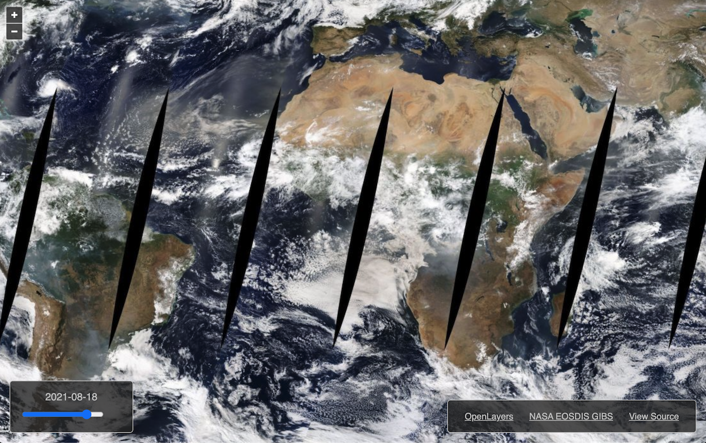

# Accessing via Map Libraries and GDAL Scripts

There are several freely-available map libraries available to help build your own interface to explore NASA's Global Imagery Browse Services (GIBS) visualizations.  The information on this page provides instructions for the following libraries:

   * [Web-based Map Libraries](#web-based-map-libraries)
   * [GDAL](#gdal)

Additionally, information regarding bulk downloading is also provided [here](#bulk-downloading).

<hr style="border:2px solid gray"> </hr>

## Web-based Map Libraries

Please see our ["GIBS Web Examples" GitHub area](https://github.com/nasa-gibs/gibs-web-examples){:target="_blank"} for code samples and live demos of using popular web mapping libraries (e.g., OpenLayers, Cesium, Mapbox GL) with GIBS.  Below is a screen capture of a barebones GIBS client based on the OpenLayers mapping library.

[{ width=70% }](https://github.com/nasa-gibs/gibs-web-examples){:target="_blank"}

<hr style="border:2px solid gray"> </hr>

## GDAL

The Geospatial Data Abstraction Library ([GDAL](https://gdal.org/){:target="_blank"}) can be used as a basis to generate imagery from custom scripts. GDAL is a well known geospatial data access library which is part of most GIS applications. GDAL can read (and sometimes write) geospatial raster and vector data in many formats, the format specific operations being handled by a GDAL driver. 

The GDAL WMS driver can access many of the known tiled and non-tiled protocols. GDAL WMS has a common part that handles interfacing with GDAL, making the requests and receiving the responses, decoding the received data as needed and a few other things. Since using tiles and multiple resolutions (known as a pyramid) is well supported in GDAL and widespread in the GIS domain, the core of the WMS driver is based on this model, and tile requests are made even when accessing a dynamic service that could provide its own subsetting and resampling.

The WMS driver supports several internal "minidrivers" that allow access to different web mapping services. Each of these services may support a different set of options in the Service block. Documentation for these minidrivers can be found in the [GDAL WMS documentation area](https://gdal.org/drivers/raster/wms.html){:target="_blank"}. Two of these minidrivers in particular can be used by users to download GIBS imagery programmatically. They are the Tile Map Specification (TMS) and the OnEarth Tiled WMS (TiledWMS) minidrivers. Examples for both of these minidrivers are included below.

The WMS driver is also used by many other GDAL drivers, for example it is used by the [GDAL WMTS driver](https://gdal.org/drivers/raster/wmts.html){:target="_blank"}. Accessing GIBS imagery the WMTS driver is detailed further below.


### Requirements

GDAL version 1.9.1 or greater with cURL support enabled. To check if cURL is enabled for GDAL, type `gdalinfo --format WMS`. If cURL is enabled, you will see information about the WMS format.  If not, you will get an error message and you will need to reconfigure GDAL to support cURL.

<hr style="border:1px solid gray"> </hr>

### Basic Usage
This section provides basic examples of both the TiledWMS and WMS GDAL drivers. The information needed to create the local service description XML can be found in the following GIBS WMTS Capabilities documents:

| Projection Name | GIBS WMTS "Best Available" Capabilities document |
| --------------- | --------- |
| Geographic | [https://gibs.earthdata.nasa.gov/wmts/epsg4326/best/1.0.0/WMTSCapabilities.xml](https://gibs.earthdata.nasa.gov/wmts/epsg4326/best/1.0.0/WMTSCapabilities.xml){:target="_blank"} |
| NSIDC Sea Ice Polar Stereographic North | [https://gibs.earthdata.nasa.gov/wmts/epsg3413/best/1.0.0/WMTSCapabilities.xml](https://gibs.earthdata.nasa.gov/wmts/epsg3413/best/1.0.0/WMTSCapabilities.xml){:target="_blank"} |
| Antarctic Polar Stereographic | [https://gibs.earthdata.nasa.gov/wmts/epsg3031/best/1.0.0/WMTSCapabilities.xml](https://gibs.earthdata.nasa.gov/wmts/epsg3031/best/1.0.0/WMTSCapabilities.xml){:target="_blank"} |
| Web Mercator | [https://gibs.earthdata.nasa.gov/wmts/epsg3857/best/1.0.0/WMTSCapabilities.xml](https://gibs.earthdata.nasa.gov/wmts/epsg3857/best/1.0.0/WMTSCapabilities.xml){:target="_blank"} |


!!! Note
    In very limited testing, our experience has been that better image quality is obtained by using the GeoTIFF output format, then converting this to other formats, if desired, using a second gdal_translate command (seen below), or other programs such as ImageMagick convert.
    ```
    gdal_translate -of JPEG GreatPlainsSmoke2.tif GreatPlainsSmoke2.jpg
    ```

#### TiledWMS Driver
TiledWMS adds a GetTileService call to the OGC WMS, the XML document returned is what contains all the information needed to configure and connect to any dataset. The GetTileService request for datasets in EPSG:4326 projection is https://gibs.earthdata.nasa.gov/twms/epsg4326/best/twms.cgi?request=GetTileService
This URL can be used by gdalinfo to get a list of available datasets with their `TiledGroupName`:
``` shell
gdalinfo "https://gibs.earthdata.nasa.gov/twms/epsg4326/best/twms.cgi?request=GetTileService"
```

To see information about a single dataset, the `gdalinfo` command may be invoked with the associated `SUBDATASET` ID of the `TiledGroupName` for the dataset by using the `-sd` flag. For example:
``` shell
gdalinfo -sd 479 "https://gibs.earthdata.nasa.gov/twms/epsg4326/best/twms.cgi?request=GetTileService"
```

To filter for specific datasets with `gdalinfo`, the `-oo TiledGroupName=` option may be used:
``` shell
gdalinfo -oo TiledGroupName="MODIS Aqua" "https://gibs.earthdata.nasa.gov/twms/epsg4326/best/twms.cgi?request=GetTileService"
```


The TiledWMS GDAL minidriver supports a simple XML configuration block (see example below) from the user, pulling all other information from the GIBS Tiled Web Map Service ([TWMS](../access-basics/#tiled-web-map-service-twms)) "Tile Service" document at runtime.

``` xml
<GDAL_WMS>
  <Service name="TiledWMS">
    <ServerUrl>https://gibs.earthdata.nasa.gov/twms/epsg4326/best/twms.cgi?</ServerUrl>
    <TiledGroupName>MODIS Aqua CorrectedReflectance TrueColor tileset</TiledGroupName>
    <Change key="${time}">2013-08-21</Change>
  </Service>
</GDAL_WMS>
```

In the above XML block, the following values may be changed to meet your needs:

* **Server Url** - Set the *ServerUrl* to a value of `{Endpoint Root}/twms.cgi?`, where the endpoint root is defined in [this](../access-basics/#service-endpoints_2) table.
    *  e.g. `https://gibs.earthdata.nasa.gov/twms/epsg4326/best/twms.cgi?`
* **Tiled Group Name** - When accessing visualizations through TWMS, the *TiledGroupName* value is utilized instead of the layers identifier. The *TiledGroupName* can also be generated by replacing all underscores in a visualization's *Identifier* from GetCapabilities with spaces and appending " tileset". For example:
    * **Identifier** - MODIS_Aqua_CorrectedReflectance_TrueColor
    * **Tiled Group Name** - MODIS Aqua CorrectedReflectance TrueColor tileset
* **Time** - Insert the date (e.g. 2013-08-21) or datetime (e.g. 2013-08-21T00:00:00Z) you are requesting. If no time is provided, you can add an option to your GDAL command to specify the value, e.g., `-oo Change=time:2020-02-05` 


The following examples demonstrate how to invoke the GDAL TiledWMS driver for imagery requests.
##### #1 - "TiledWMS" Driver Configuration File Input
In this example, the following XML file is created and saved to your local file system.  Then the `gdal_translate` command shown below is run with your desired area of interest and output dimensions.  

``` xml
<GDAL_WMS>
  <Service name="TiledWMS">
    <ServerUrl>https://gibs.earthdata.nasa.gov/twms/epsg4326/best/twms.cgi?</ServerUrl>
    <TiledGroupName>MODIS Aqua CorrectedReflectance TrueColor tileset</TiledGroupName>
    <Change key="${time}">2013-08-21</Change>
  </Service>
</GDAL_WMS>
```
Let's save the XML as a file named `GIBS_Aqua_MODIS_true.xml`

```
gdal_translate -of GTiff -outsize 1200 1000 -projwin -105 42 -93 32 GIBS_Aqua_MODIS_true.xml GreatPlainsSmoke1.tif
```
The XML file can be opened in any GDAL based GIS software. However, in ArcGIS Pro, TileWMS is not recognized without some extra configuration steps, but it can be dragged and dropped into a map and it will work. Alternatively, we can change the extension into something supported, like .tif for example.

This file shows one of the main advantages of the TiledWMS over other GDAL WMS minidriver protocols. Only the minimum amount of information is stored in the handle file. No fiddling with bounding boxes, tile sizes, number of levels is required. Getting the detail correct becomes the responsibility of the source server. All that is needed is the server URL, the name of the tiled group and optionally a set of parameter changes supported by the tiled group.

##### #2 - "TiledWMS" Driver Command Line Input
This example invokes gdal_translate with the content of the TileWMS local service description XML file embedded as a command line argument. This approach is useful for automated scripting to download various layers, dates, etc. To generate the same image as the previous example, run the following:

```
gdal_translate -of GTiff -outsize 1200 1000 -projwin -105 42 -93 32 '<GDAL_WMS><Service name="TiledWMS"><ServerUrl>https://gibs.earthdata.nasa.gov/twms/epsg4326/best/twms.cgi?</ServerUrl><TiledGroupName>MODIS Aqua CorrectedReflectance TrueColor tileset</TiledGroupName><Change key="${time}">2013-08-21</Change></Service></GDAL_WMS>' GreatPlainsSmoke2.tif
```
##### #3 - "TiledWMS" Driver Configuration File for All Datasets
The TiledGroupName can also be fed as an open option. Create the following XML file:
``` xml
<GDAL_WMS>
  <Service name="TiledWMS">
    <ServerUrl>https://gibs.earthdata.nasa.gov/twms/epsg4326/best/twms.cgi?</ServerUrl>
  </Service>
</GDAL_WMS>
```
Let's save the XML as a file named `GIBS_epsg4326.xml`. Now we can run `gdal_translate` and use the `-oo` options to specify the dataset and time.
``` shell
gdal_translate -of JPEG -outsize 2560 1280 -oo TiledGroupName="MODIS Aqua CorrectedReflectance TrueColor tileset" -oo Change=time:2020-02-05 GIBS_epsg4326.xml MODIS_A_Feb_05_2020.jpg
```

##### #4 - Generate "TiledWMS" Configuration Files for Specified Datasets
gdal_translate has a `-sds` option where each subdataset of the input is copied, in sequence. This can be used to generate multiple handle files in a single command. We can use the open options to restrict which gets generated. For example, this generates all the handle files for patterns that contain the word "infrared":
``` shell
gdal_translate -of WMS -sds -oo TiledGroupName="infrared" -oo Change=time:2019-10-21 "https://gibs.earthdata.nasa.gov/twms/epsg4326/best/twms.cgi?request=GetTileService" Infrared.tWMS
```
Additionally, a `StoreConfiguration` open option can be applied to store the GetTileService response locally to speed up the requests:
``` shell
gdal_translate -of WMS -sds -oo StoreConfiguration=yes -oo TiledGroupName="infrared" -oo Change=time:2019-10-21 "https://gibs.earthdata.nasa.gov/twms/epsg4326/best/twms.cgi?request=GetTileService" Infrared.tWMS
```

<hr style="border:1px solid gray"> </hr>

#### "TMS Driver"
The TMS GDAL minidriver relies on a more complex XML configuration block (see example below) from the user that defines all information required for accessing a tiled visualization service.


``` xml
    <GDAL_WMS>
        <Service name="TMS">
        <ServerUrl>https://gibs.earthdata.nasa.gov/wmts/epsg4326/best/MODIS_Aqua_CorrectedReflectance_TrueColor/default/2013-08-21/250m/${z}/${y}/${x}.jpg</ServerUrl>
        </Service>
        <DataWindow>
            <UpperLeftX>-180.0</UpperLeftX>
            <UpperLeftY>90</UpperLeftY>
            <LowerRightX>396.0</LowerRightX>
            <LowerRightY>-198</LowerRightY>
            <TileLevel>8</TileLevel>
            <TileCountX>2</TileCountX>
            <TileCountY>1</TileCountY>
            <YOrigin>top</YOrigin>
        </DataWindow>
        <Projection>EPSG:4326</Projection>
        <BlockSizeX>512</BlockSizeX>
        <BlockSizeY>512</BlockSizeY>
        <BandsCount>3</BandsCount>
    </GDAL_WMS>
```

In the above XML block, the following values may be changed to meet your needs:

* <ServerUrl\>https://gibs.earthdata.nasa.gov/wmts/**epsgcode**/best/**layer_name**/default/**date**/**resolution**/${z}/${y}/${x}.**format**</ServerUrl\>
    * **layer_name** - use the layer's "Identifier" from the relevant GIBS WMTS GetCapabilities document. Note that only one layer can be retrieved per gdal_translate call.
    * **date** - use the desired date in YYYY-MM-DD format
    * **epsgcode** - use "epsg" followed by the appropriate EPSG code as defined in [this](../access-basics/#map-projections) table.
    * **resolution** - use the layer's "TileMatrixSet" value from the relevant GIBS WMTS GetCapabilities document
    * **format** - use jpg or png extension based on the "Format"
* **Bounding box** - use `-180.0, 90, 396.0, -198` for Geographic projection and `-4194304, 4194304, 4194304, -4194304` for the Polar projections
* **<TileLevel\>** - select from the table below based on "Resolution" and "Projection". Note that the TileLevel in the table below is the maximum for that resolution. You can specify a lower value of TileLevel to force GDAL to use coarser resolution input tiles. This can be used to speed up projection, for example during development and testing.

   | Resolution | TileLevel (Geographic) | TileLevel (Polar) | Resolution (Web Mercator) | Tile Level (Web Mercator) |
       | ---------- | ---------------------- | ----------------- | ------------------------- | ------------------------- |
   | 2km | 5 | 2 | GoogleMapsCompatible_Level6 | 6 |
   | 1km | 6 | 3 | GoogleMapsCompatible_Level7 | 7 |
   | 500m | 7 | 4 | GoogleMapsCompatible_Level8 | 8 |
   | 250m | 8 | 5 | GoogleMapsCompatible_Level9 | 9 |
   | 125m | 9 | - | GoogleMapsCompatible_Level10 | 10 |
   | 62.5m | 10 | - | GoogleMapsCompatible_Level11 | 11 |
   | 31.25m | 11 | - | GoogleMapsCompatible_Level12 | 12 |
   | 15.625m | 12 | - | GoogleMapsCompatible_Level3 | 13 |

* **<TileCountX\><TileCountY\>** - use 2, 1 for Geographic projection and 2, 2 for Polar projections
* **<Projection\>** - use the appropriate EPSG code as described in the above "epsgcode" table
* **<Bands\>** - use 3 for .jpg (except use 1 for ASTER_GDEM_Greyscale_Shaded_Relief) and 4 for .png

!!! note
    The values for <YOrigin\>, <BlockSizeX\>, and <BlockSizeY\> are constant for all GIBS layers.

The following examples demonstrate how to invoke the GDAL TMS driver.

##### #1 - Configuration File Input
Create a local service description XML file and invoke gdal_translate. In this example, GIBS_Aqua_MODIS_true.xml is used to generate a true color JPEG image from Aqua MODIS of a smoke plume from western fires over the central United States. The contents of GIBS_Aqua_MODIS_true.xml would be:

``` xml
    <GDAL_WMS>
        <Service name="TMS">
        <ServerUrl>https://gibs.earthdata.nasa.gov/wmts/epsg4326/best/MODIS_Aqua_CorrectedReflectance_TrueColor/default/2013-08-21/250m/${z}/${y}/${x}.jpg</ServerUrl>
        </Service>
        <DataWindow>
            <UpperLeftX>-180.0</UpperLeftX>
            <UpperLeftY>90</UpperLeftY>
            <LowerRightX>396.0</LowerRightX>
            <LowerRightY>-198</LowerRightY>
            <TileLevel>8</TileLevel>
            <TileCountX>2</TileCountX>
            <TileCountY>1</TileCountY>
            <YOrigin>top</YOrigin>
        </DataWindow>
        <Projection>EPSG:4326</Projection>
        <BlockSizeX>512</BlockSizeX>
        <BlockSizeY>512</BlockSizeY>
        <BandsCount>3</BandsCount>
    </GDAL_WMS>
```

```
    gdal_translate -of GTiff -outsize 1200 1000 -projwin -105 42 -93 32 GIBS_Aqua_MODIS_true.xml GreatPlainsSmoke1.tif
```

##### #2 - "TMS" Driver Command Line Input
Invoke gdal_translate with the content of the local service description XML file embedded into the command. This approach is useful for automated scripting to download various layers, dates, etc. To generate the same image as above:

```
gdal_translate -of GTiff -outsize 1200 1000 -projwin -105 42 -93 32 '<GDAL_WMS><Service name="TMS"><ServerUrl>https://gibs.earthdata.nasa.gov/wmts/epsg4326/best/MODIS_Aqua_CorrectedReflectance_TrueColor/default/2013-08-21/250m/${z}/${y}/${x}.jpg</ServerUrl></Service><DataWindow><UpperLeftX>-180.0</UpperLeftX><UpperLeftY>90</UpperLeftY><LowerRightX>396.0</LowerRightX><LowerRightY>-198</LowerRightY><TileLevel>8</TileLevel><TileCountX>2</TileCountX><TileCountY>1</TileCountY><YOrigin>top</YOrigin></DataWindow><Projection>EPSG:4326</Projection><BlockSizeX>512</BlockSizeX><BlockSizeY>512</BlockSizeY><BandsCount>3</BandsCount></GDAL_WMS>' GreatPlainsSmoke2.tif
```

<hr style="border:1px solid gray"> </hr>

#### "WMTS Driver"
A WMTS driver was added to GDAL in version 2.1 and greater. It can be used with the GIBS GetCapabilities to get a list of available datasets:
``` shell 
gdalinfo "https://gibs.earthdata.nasa.gov/wmts/epsg4326/best/wmts.cgi?SERVICE=WMTS&request=GetCapabilities"
```
or information about a single dataset using the `WMTS:` prefix:
``` shell 
gdalinfo "WMTS:https://gibs.earthdata.nasa.gov/wmts/epsg4326/best/wmts.cgi?SERVICE=WMTS&request=GetCapabilities,layer=MODIS_Terra_CorrectedReflectance_TrueColor"
```

**Note the drawback of using WMTS is that the `time` parameter is not supported. This means users are limited to only the default `time` for any given layer.**

##### #1 - Configuration File Input
Create a local service description XML file and invoke gdal_translate. In this example, GIBS_Terra_MODIS_true.xml is used to generate a true color JPEG image from Terra MODIS of the entire world for the current day. The contents of GIBS_Terra_MODIS_true.xml would be:

``` xml
<GDAL_WMTS>
  <GetCapabilitiesUrl>https://gibs.earthdata.nasa.gov/wmts/epsg4326/best/wmts.cgi?SERVICE=WMTS&amp;request=GetCapabilities</GetCapabilitiesUrl>
  <Layer>MODIS_Terra_CorrectedReflectance_TrueColor</Layer>
  <Style>default</Style>
  <TileMatrixSet>250m</TileMatrixSet>
  <DataWindow>
    <UpperLeftX>-180</UpperLeftX>
    <UpperLeftY>90</UpperLeftY>
    <LowerRightX>180</LowerRightX>
    <LowerRightY>-90</LowerRightY>
  </DataWindow>
  <BandsCount>3</BandsCount>
  <DataType>Byte</DataType>
  <Cache />
</GDAL_WMTS>
```
```
gdal_translate -of JPEG -outsize 2560 1280 GIBS_Terra_MODIS_true.xml GIBS_Terra_MODIS_true.jpeg
```

##### #2 - "WMTS" Driver Command Line Input
Invoke gdal_translate with the content of the local service description XML file embedded into the command. To generate the same image as above:
```
gdal_translate -of JPEG -outsize 2560 1280 "WMTS:https://gibs.earthdata.nasa.gov/wmts/epsg4326/best/wmts.cgi?SERVICE=WMTS&request=GetCapabilities,layer=MODIS_Terra_CorrectedReflectance_TrueColor" MODIS_Terra_default.jpg
```
Note that the WMTS driver defaults to 4 bands, which may result in discoloration if the incorrect number of bands is specified. There is currently not a way to specify the number of bands from the command line with the WMTS driver, which may result in discoloration with this example.

<hr style="border:1px solid gray"> </hr>

### Advanced Usage
#### TMS Driver Configuration File Input w/ Transparent PNG

In this example, GIBS_OMI_AI.xml is used to generate a transparent PNG image from the OMI Aerosol Index over the same region as the first two examples. The "Layer Name on Server" and EPSG/resolution in <ServerURL\>, the <TileLevel\>, and the <BandsCount\> have changed from the first examples. The contents of GIBS_OMI_AI.xml would be:

```
<GDAL_WMS>
    <Service name="TMS">
        <ServerUrl>https://gibs.earthdata.nasa.gov/wmts/epsg4326/best/OMI_Aerosol_Index/default/2013-08-21/2km/${z}/${y}/${x}.png</ServerUrl>
    </Service>
    <DataWindow>
        <UpperLeftX>-180.0</UpperLeftX>
        <UpperLeftY>90</UpperLeftY>
        <LowerRightX>396.0</LowerRightX>
        <LowerRightY>-198</LowerRightY>
        <TileLevel>5</TileLevel>
        <TileCountX>2</TileCountX>
        <TileCountY>1</TileCountY>
        <YOrigin>top</YOrigin>
    </DataWindow>
    <Projection>EPSG:4326</Projection>
    <BlockSizeX>512</BlockSizeX>
    <BlockSizeY>512</BlockSizeY>
    <BandsCount>4</BandsCount>
</GDAL_WMS>
```

```
gdal_translate -of GTiff -outsize 1200 1000 -projwin -105 42 -93 32 GIBS_OMI_AI.xml GreatPlainsSmokeAI.tif
```

#### TMS Driver Polar Imagery

In this example, GIBS_Terra_MODIS_Arctic.xml is used to generate a true color JPEG image from Terra MODIS of a phytoplankton bloom in the Barents Sea. The "Layer Name on Server" and EPSG/resolution in <ServerUrl\>, the <DataWindow\> elements, and the <Projection\> have changed from the first examples. The contents of GIBS_Terra_MODIS_Arctic.xml would be:

```
<GDAL_WMS>
    <Service name="TMS">
        <ServerUrl>https://gibs.earthdata.nasa.gov/wmts/epsg3413/best/MODIS_Terra_CorrectedReflectance_TrueColor/default/2013-08-01/250m/${z}/${y}/${x}.jpg</ServerUrl>
    </Service>
    <DataWindow>
        <UpperLeftX>-4194304</UpperLeftX>
        <UpperLeftY>4194304</UpperLeftY>
        <LowerRightX>4194304</LowerRightX>
        <LowerRightY>-4194304</LowerRightY>
        <TileLevel>5</TileLevel>
        <TileCountX>2</TileCountX>
        <TileCountY>2</TileCountY>
        <YOrigin>top</YOrigin>
    </DataWindow>
    <Projection>EPSG:3413</Projection>
    <BlockSizeX>512</BlockSizeX>
    <BlockSizeY>512</BlockSizeY>
    <BandsCount>3</BandsCount>
</GDAL_WMS>
```

GeoTIFF files created by GDAL using the default tags for the GIBS polar projections do not work correctly in some GIS programs. So we recommend specifying the output projection in PROJ4 format:

```
gdal_translate -of GTiff -outsize 980 940 -a_srs "+proj=stere +lat_0=90 +lat_ts=70 +lon_0=-45 +k=1 +x_0=0 +y_0=0 +ellps=WGS84 +datum=WGS84 +units=m +no_defs" -projwin 1520000 240000 2500000 -700000 GIBS_Terra_MODIS_Arctic.xml BarentsSea.tif
gdal_translate -of JPEG BarentsSea.tif BarentsSea.jpg
```

The projection string for the GIBS Antarctic projection is "+proj=stere +lat_0=-90 +lat_ts=-71 +lon_0=0 +k=1 +x_0=0 +y_0=0 +ellps=WGS84 +datum=WGS84 +units=m +no_defs". Here are the links for the [Arctic](http://spatialreference.org/ref/epsg/3413/proj4/){:target="_blank"} and [Antarctic](http://spatialreference.org/ref/epsg/3031/proj4/){:target="_blank"} PROJ4 definitions. Some other workarounds are:

* Use a ".aux.xml" file with the ".tif" file. Download the sample [Arctic](img/GIBS_Arctic_3413.tif.aux.xml){:target="_blank"} or [Antarctic](img/GIBS_Antarctic_3031.tif.aux.xml){:target="_blank"} XML file and rename it to match the GeoTIFF file.

```
gdal_translate -of GTiff -outsize 980 940 -projwin 1520000 240000 2500000 -700000 GIBS_Terra_MODIS_Arctic.xml BarentsSea.tif
"copy" GIBS_Arctic_3413.tif.aux.xml "to"  BarentsSea.tif.aux.xml
gdal_translate -of JPEG BarentsSea.tif BarentsSea.jpg
```

* Use JPEG format instead. This will create a .jpg.aux.xml file in addition to the .jpg file.

```
gdal_translate -of JPEG -outsize 980 940 -projwin 1520000 240000 2500000 -700000 GIBS_Terra_MODIS_Arctic.xml BarentsSea.jpg
```

#### TMS Driver Polar Layer w/ Reprojection

In this example, GIBS_Aqua_MODIS_Arctic.xml is used to generate a true color JPEG image from Aqua MODIS of the Beaufort Sea reprojected to have 145W down. The "Layer Name on Server" and EPSG/resolution in <ServerUrl\>, the <DataWindow\> elements, and the <Projection\> have changed from the first examples. The contents of GIBS_Aqua_MODIS_Arctic.xml would be:

```
<GDAL_WMS>
    <Service name="TMS">
        <ServerUrl>https://gibs.earthdata.nasa.gov/wmts/epsg3413/best/MODIS_Aqua_CorrectedReflectance_TrueColor/default/2013-06-20/250m/${z}/${y}/${x}.jpg</ServerUrl>
    </Service>
    <DataWindow>
        <UpperLeftX>-4194304</UpperLeftX>
        <UpperLeftY>4194304</UpperLeftY>
        <LowerRightX>4194304</LowerRightX>
        <LowerRightY>-4194304</LowerRightY>
        <TileLevel>5</TileLevel>
        <TileCountX>2</TileCountX>
        <TileCountY>2</TileCountY>
        <YOrigin>top</YOrigin>
    </DataWindow>
    <Projection>EPSG:3413</Projection>
    <BlockSizeX>512</BlockSizeX>
    <BlockSizeY>512</BlockSizeY>
    <BandsCount>3</BandsCount>
</GDAL_WMS>
```

```
gdalwarp -t_srs '+proj=stere +lat_0=90 +lat_ts=70 +lon_0=-145 +k=1 +x_0=0 +y_0=0 +datum=WGS84 +units=m +no_defs' -te -1600000 -2500000 1200000 -400000 -tr 1000 1000 GIBS_Aqua_MODIS_Arctic.xml Beaufort_neg145down_1km.tif
gdal_translate -of JPEG Beaufort_neg145down_1km.tif Beaufort_neg145down_1km.jpg
```

#### TMS Driver Reprojecting GIBS Geographic layer into Polar Stereographic

Only a subset of layers are available from GIBS in the polar projections. This is an example of how to project a geographic layer into a polar projection. The contents of GIBS_Terra_Cloud_Fraction.xml would be:

```
<GDAL_WMS>
    <Service name="TMS">
        <ServerUrl>https://gibs.earthdata.nasa.gov/wmts/epsg4326/best/MODIS_Terra_Cloud_Fraction_Day/default/2017-05-16/2km/${z}/${y}/${x}.png</ServerUrl>
    </Service>
    <DataWindow>
        <UpperLeftX>-180.0</UpperLeftX>
        <UpperLeftY>90</UpperLeftY>
        <LowerRightX>180.0</LowerRightX>
        <LowerRightY>0</LowerRightY>
        <TileLevel>5</TileLevel>
        <TileCountX>2</TileCountX>
        <TileCountY>1</TileCountY>
        <YOrigin>top</YOrigin>
    </DataWindow>
    <Projection>EPSG:4326</Projection>
    <BlockSizeX>512</BlockSizeX>
    <BlockSizeY>512</BlockSizeY>
    <BandsCount>4</BandsCount>
    <ZeroBlockHttpCodes>204,404,400</ZeroBlockHttpCodes>
</GDAL_WMS>
```

```
gdalwarp -wo SOURCE_EXTRA=100 -wo SAMPLE_GRID=YES -of GTiff -t_srs "+proj=stere +lat_0=90 +lat_ts=70 +lon_0=-45 +k=1 +x_0=0 +y_0=0 +ellps=WGS84 +datum=WGS84 +units=m +no_defs" -ts 4096 4096 -te -4194304 -4194304 4194304 4194304 GIBS_Terra_Cloud_Fraction.xml Terra_Cloud_Fraction_Arctic.tif
```

<hr style="border:2px solid gray"> </hr>

## Python

[**Accessing via Python**](../python-usage/) - Python examples of accessing GIBS imagery (also downloadable as a [**Jupyter Notebook**](https://github.com/nasa-gibs/gibs-api-docs/raw/main/docs/python-usage.ipynb))

## Bulk Downloading

A "Bulk Download" is defined as the planned retrieval of more than 1,000,000 imagery tiles within a 24 hour period. These activities are typically orchestrated through script-based access to the GIBS API, not user-based access through a client application. In order to ensure quality of service for all GIBS users, the GIBS team requests that bulk downloading activities be coordinated at least 48 hours in advance of the planned download. Prior to
beginning your bulk downloading activities, please contact the GIBS support team at [earthdata-support@nasa.gov](mailto:earthdata-support@nasa.gov?subject=GIBS Bulk Download Request) with the subject "GIBS Bulk
Download Request" and the following information:

1. Purpose
2. Primary POC (Email & Phone)
3. Layers
4. Zoom Level(s)
5. Date(s)
6. Expected Load Profile
    * Start and End Times
    * Request Volume per Hour
    * Number of Concurrent Downloads
7. Source IP Address(es)

The GIBS utilization profile indicates that there is not a period of time within which "regular" usage drops. Therefore, bulk downloading activities are
allowed to occur as is convenient for the downloading group or individual. The following guidelines should be taken into consider when designing a
bulk download plan:

1. Limit sustained download bandwidth to 50 Mbps.
    * For GIBS overlay (PNG) layers, this is an approximate minimum of 150k tiles per hour due to the large size variation based on the image content density.
    * For GIBS base (JPEG) layers, this is approximately 350k tiles per hour with limited variation in image size across products and geographic regions.
2. Limit concurrent downloads to 500 threads
3. Evenly distribute download requests across the entire bulk downloading period, avoiding significant spikes of activity.
4. Start small with fewer concurrent threads and build to your proposed maximum download rate.

Subscribe to our mailing list [by sending an email to this address](mailto:eosdis-gibs-announce-join@lists.nasa.gov) (no subject or text in the body is needed) and [follow our blog](https://wiki.earthdata.nasa.gov/pages/viewrecentblogposts.action?key=GIBS){:target="_blank"} to stay up-to-date with new features and changes to existing services. Or contact us at [earthdata-support@nasa.gov](mailto:earthdata-support@nasa.gov?subject=GIS API Questions) with feedback and questions.
